# Ačiū, kad esate kartu

<!-- TODO: yra ką taisyti su žmonių kadencijų laikais -->

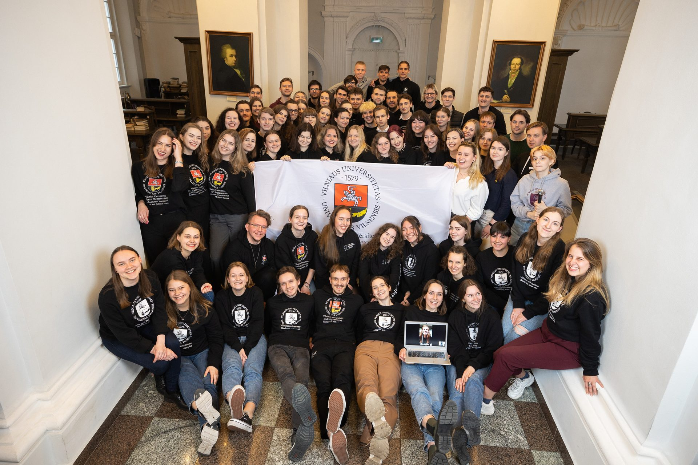

## Sritys

<PhotoGrid :photos="teamPhotos" />

## Centrinis biuras

<TeamAvatarLayout :members="biuras" />

## Taryba

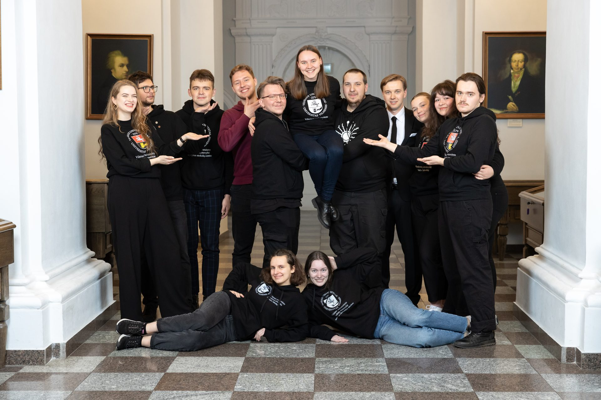

Daugiau apie Tarybą [skaitykite čia](/vu-sa/taryba.md).

## Parlamentas

Daugiau apie Parlamentą [skaitykite čia](/vu-sa/parlamentas.md).

## ISF

Daugiau apie ISF [skaitykite čia](/stipri-organizacija/isf.md).

## Duomenų apsaugos grupė

<TeamAvatarLayout :members="dag" />

## Socialinio-akademinio proceso reikalų koordinatoriai

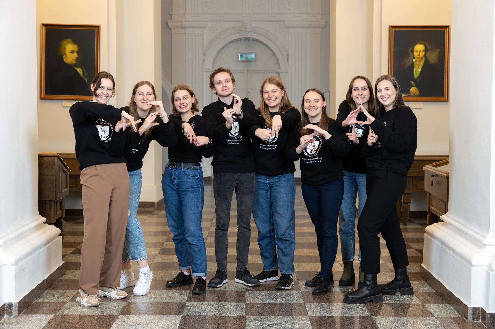

<TeamAvatarLayout :members="socakad" />

## Atstovų koordinatoriai

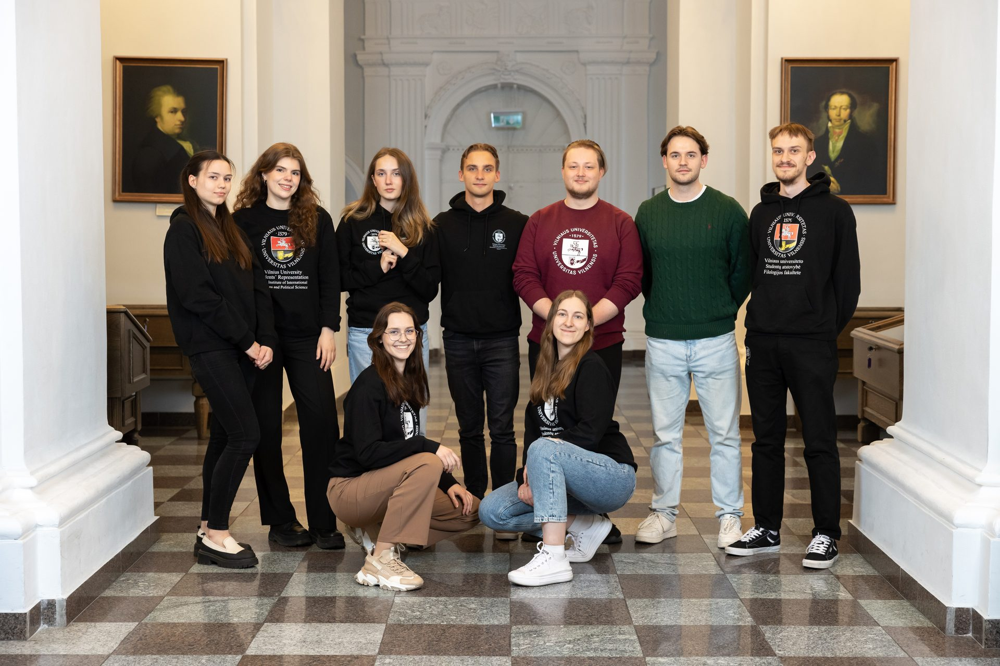

<TeamAvatarLayout :members="atstovai" />

## Komunikacijos koordinatoriai

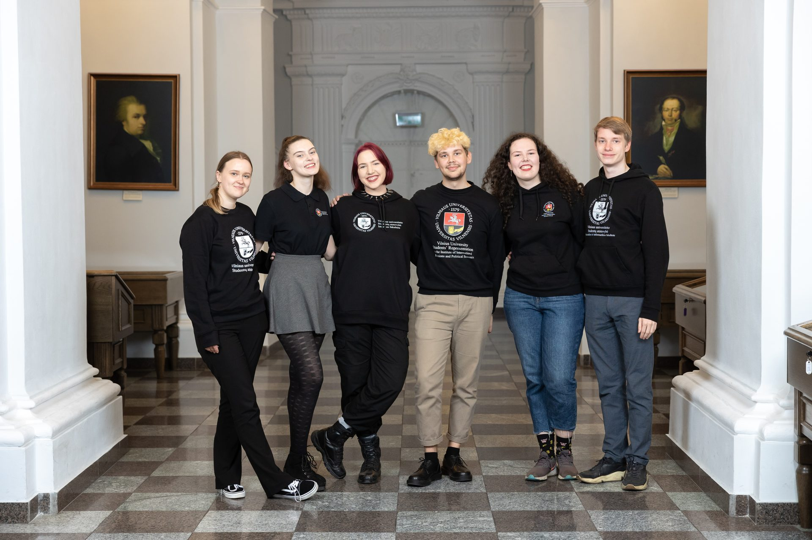

<TeamAvatarLayout :members="kom" />

## Marketingo koordinatoriai

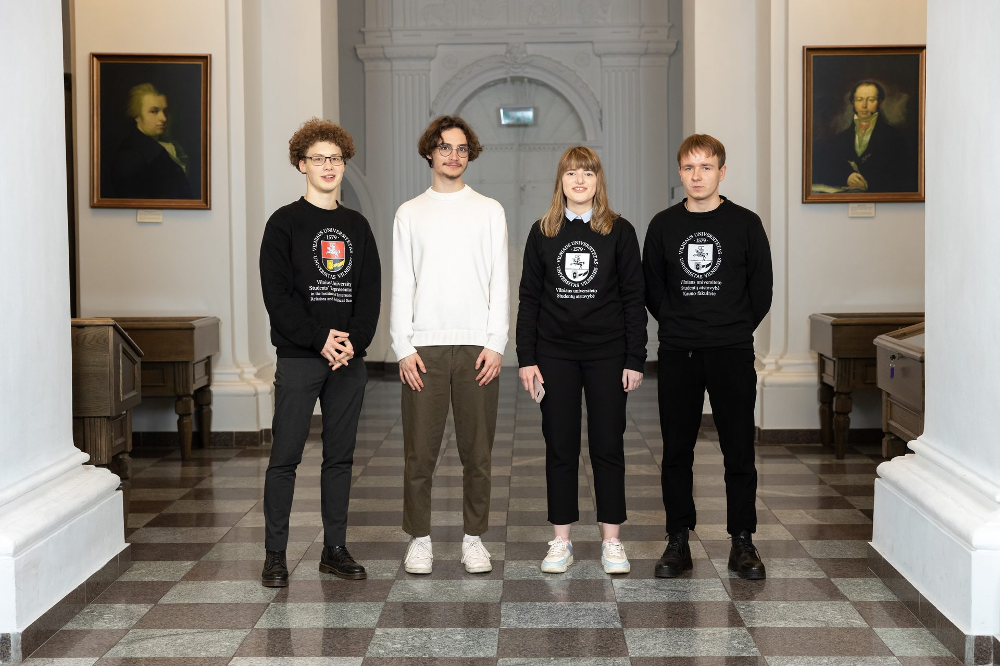

<TeamAvatarLayout :members="mark" />

## Organizacinės srities koordinatoriai

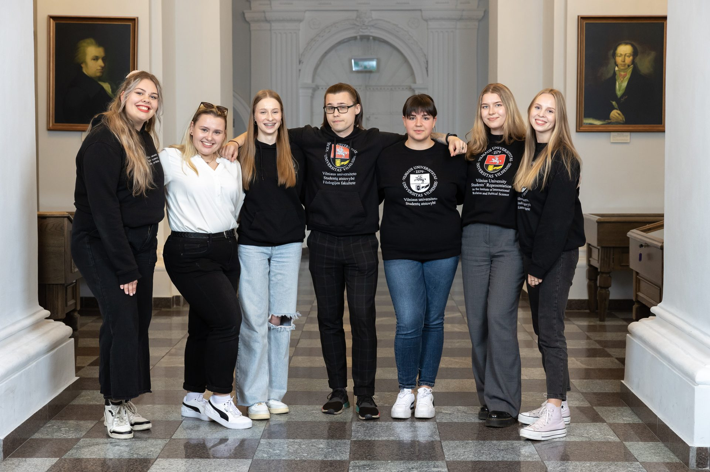

<TeamAvatarLayout :members="org" />

## Žmogiškųjų išteklių koordinatoriai

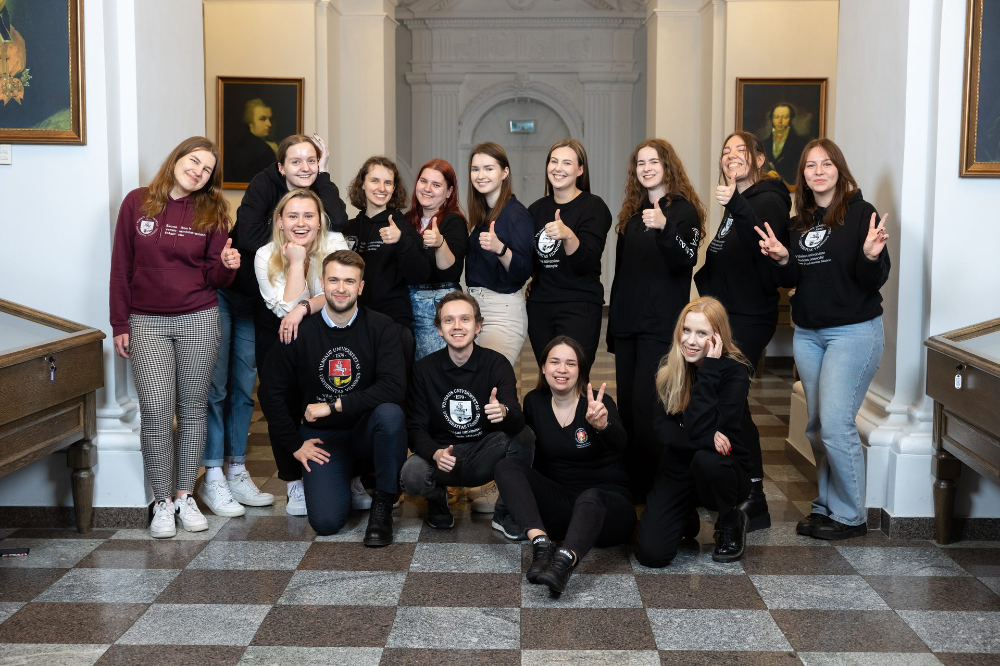

<TeamAvatarLayout :members="hr" />

## Integracijos srities koordinatoriai

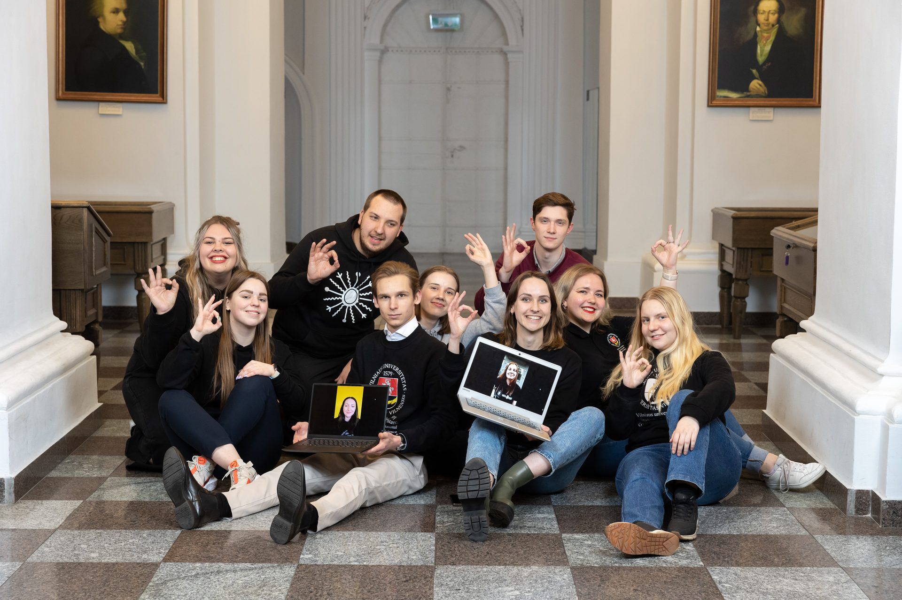

<TeamAvatarLayout :members="integration" />

## Administratoriai

<TeamAvatarLayout :members="admin" />

## PKP

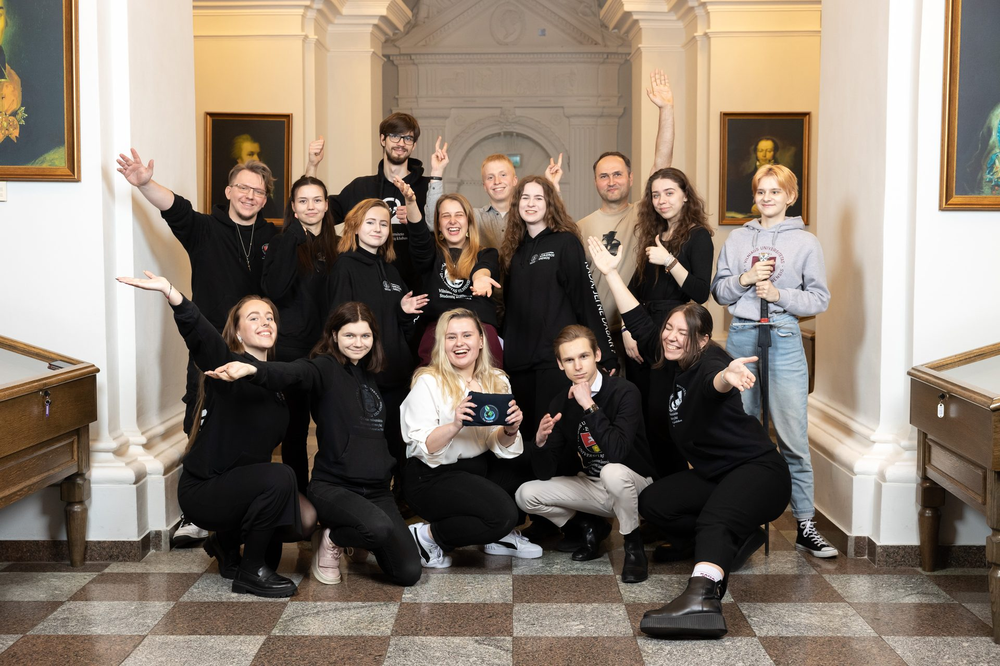

<TeamAvatarLayout :members="pkp" />

## Tarptautinių studentų koordinatoriai

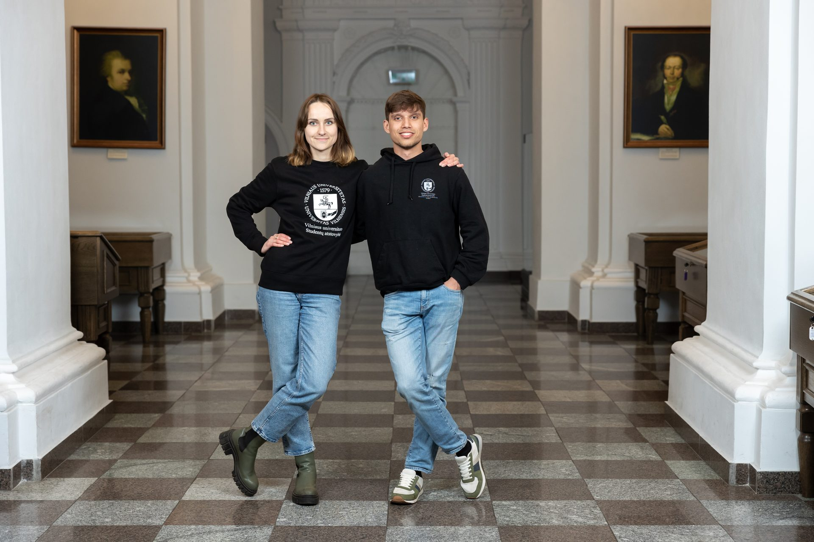

<TeamAvatarLayout :members="intl" />

## LSP

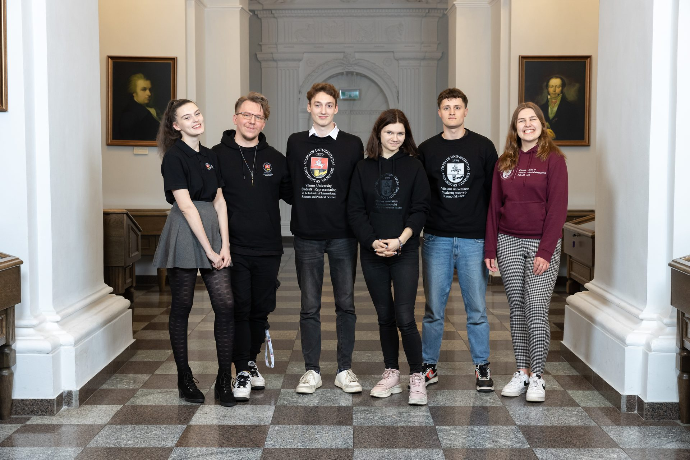

<TeamAvatarLayout :members="lsp" />

## IT bei SMD koordinatoriai

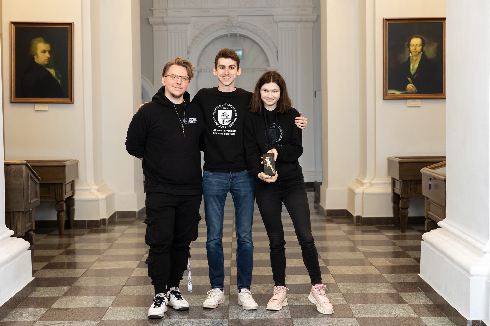

<TeamAvatarLayout :members="other" />
