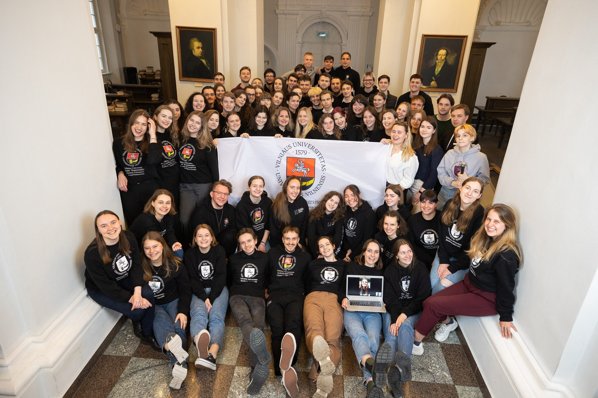
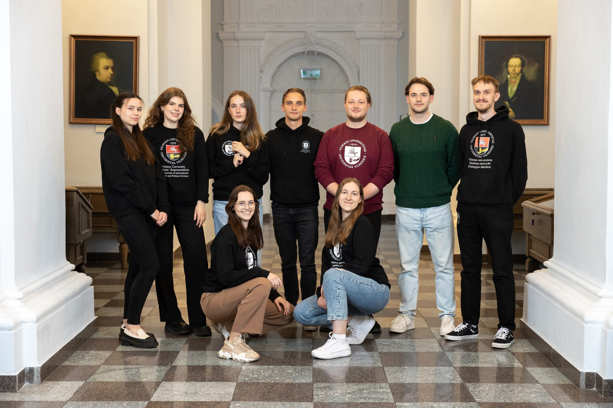
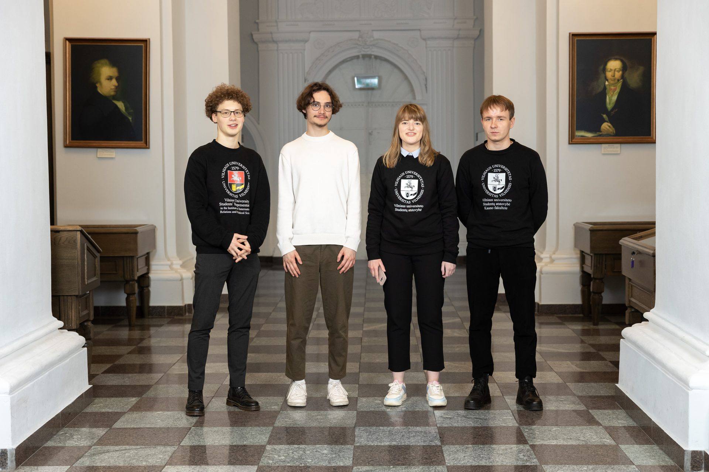
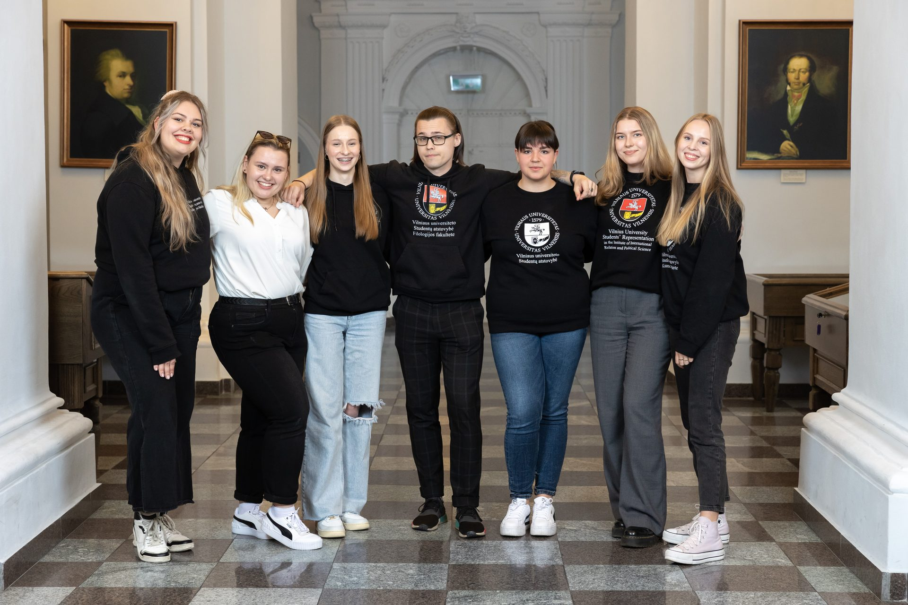
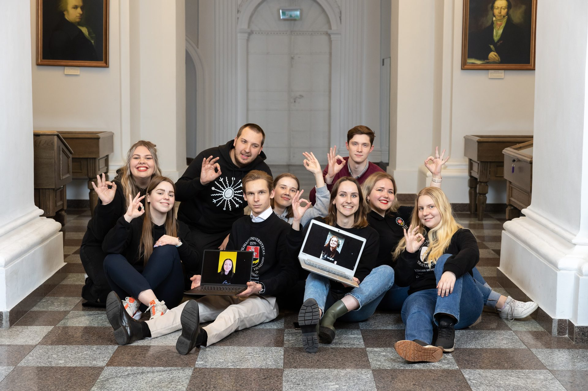
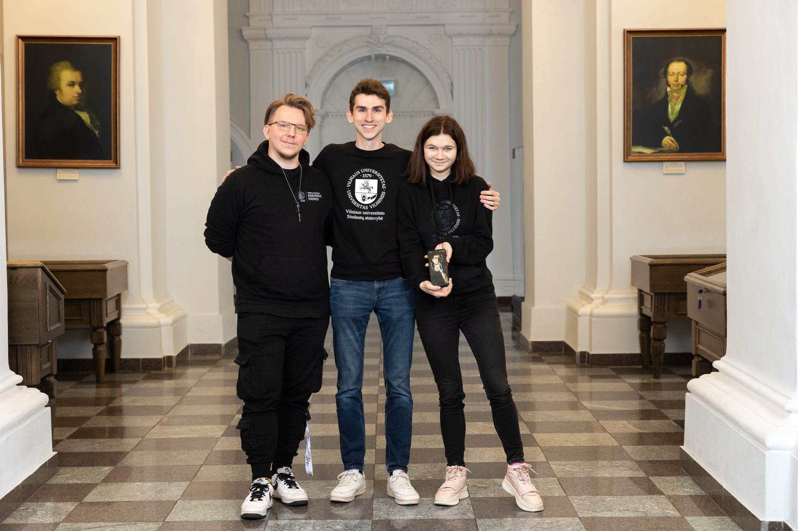

# Thanks you for being with us

<PhotoGrid :photos="teamPhotos" />

## Central Office

<TeamAvatarLayout :members="biuras" />

## VU SR Board

More about the Parliament [read here](/en/vu-sa/taryba.md).

## Parlamentas

More about the Parliament [read here](/en/vu-sa/parlamentas.md).

## ISF

More about ISF [read here](/en/stipri-organizacija/isf.md).

## Data Security Group

<TeamAvatarLayout :members="dag" />

## Coordinators of Socioacademic Affairs

<TeamAvatarLayout :members="socakad" />

## Representatives\' Coordinators

<TeamAvatarLayout :members="atstovai" />

## Coordinators of Communication

<TeamAvatarLayout :members="kom" />

## Coordinators of Marketing

<TeamAvatarLayout :members="mark" />

## Coordinators of Organizational Affairs

<TeamAvatarLayout :members="org" />

## Coordinators of Human Resources

<TeamAvatarLayout :members="hr" />

## Coordinators of Integration Process

<TeamAvatarLayout :members="integration" />

## Administrators

<TeamAvatarLayout :members="admin" />

## Programs, Clubs and Projects

<TeamAvatarLayout :members="pkp" />

## Coordinators of Foreign Student Affairs

<TeamAvatarLayout :members="intl" />

## Coordinators of LSIC

<TeamAvatarLayout :members="lsp" />

## IT and SMD coordinators

<TeamAvatarLayout :members="other" />
