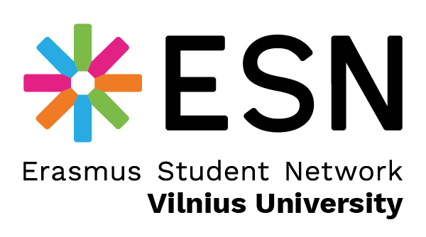

# Programs, Clubs and Projects

## START FM

VU radio START FM – VU SR and Vilnius University radio station, which
started its activities in 2005, the only radio station for students in
Lithuania provides wide opportunities for self-expression for students:
it helps to train future journalists, programmers, and specialists in
other fields. START FM also actively supports the dissemination of the
works of alternative Lithuanian and foreign performers and music groups,
organizes interviews with music performers, supports various artistic
and social initiatives.

The radio program is intended for members of the academic community of
Vilnius city and Lithuanian universities and schools, young people, and
all residents of the country with musical literacy.

START FM is a unique medium for the emergence and development of youth
initiatives: the broadcasts reflect the current issues of the life of
the academic community and young people, as they are initiated and
implemented by members of the community – students, graduates,
lecturers of Vilnius University and other Lithuanian higher education
institutions, and reflect the current issues of the life of the academic
community and young people.

The social significance of the station is enhanced by the fact that the
radio START FM always tries to help the creators of social initiatives,
providing an opportunity to inform the public about their activities and
actions. During the reference period, cultural, educational,
informational shows were prepared and broadcast, conditions were created
for VU Journalism students to acquire practical knowledge and skills,
and in order to popularize both Lithuanian and foreign alternative
groups and performers, the music archive was redesigned. The upgrading
of the technical and software infrastructure of the radio station has
also begun, and the sounding has been improved both on the FM wave
section and on the webcast.

## VU Debate Club

During the reference period, the club\'s activities were coordinated by
Matas Petravičius.

VU Debating Club is a club founded in 2004 to promote communication
between students of different faculties, providing a space for the
development of critical thinking, reasoning, English language, and
public speaking skills, and representing Vilnius University in debate
tournaments.

In 2022--2023, VU Debating Club successfully continued and developed its
activities. The team, which was formed last year, consolidated the
conduct of the debate session every week, expanded and updated the list
of members, and developed competencies. The efforts made brought good
results – the club sent a delegation to participate in the SSE Riga
2022 debate tournament, where the name of Vilnius University was
represented at the international level. After the New Year, the club
renewed its image in the digital space and began to establish contacts
with other debate organizations in Lithuania. The members of the club
were invited to judge in the playoff rounds of the Lithuanian Students\'
National Tournament, as well as to carry out educational activities
about debates in Lithuanian schools and events for scholars.

The renewed club board continues to organize new events and expands its
activities and the circle of club members, develops competencies
internally and fosters a culture of debate in Lithuania.

## "Students - for pupils, pupils - for students (SMMS)"

During the reference period, the project activities were coordinated by
Tomas Mikalauskas.

"Students - for pupils, pupils - for students (SMMS)" is a 3-day camp
organized by VU SR for senior scholars. The aim of the camp is to help
scholars choose the right study path for them by introducing Vilnius
University and its opportunities.

This year\'s SMMS camp was attended by more than 50 scholars from all
over Lithuania, who were given the opportunity not only to visit Vilnius
University, but also to walk around Vilnius city during the orienteering
game, to get acquainted with Saulėtekis academic campus and to feel the
student spirit. Also, during the camp, the scholars together with the
mentors visited the selected faculties throughout the day and were
introduced to the admission and study processes of Vilnius University.

## Sąžiningai

During the reference period, the program was coordinated by Justė Ieva
Žilionytė and a working group convened by the VU SR Council.

\"Sąžiningai\" is a VU SR program that fosters the academic ethics of
the Vilnius University community and promotes a culture of academic
integrity. The participants contributing to the activities of the
program seek to reduce the cases of write-off, plagiarism, and
procurement of written works. To promote academic integrity,
observations of ongoing interim and final settlements (colloquiums and
examinations) are organized, information campaigns, rubrics are
organized, studies are carried out, articles and reviews are prepared.

In 2022-2023, not only observations of intermediate settlements and
exams took place, but also a review and refinement of the direction of
activity of the \"Sąžiningai\" program. During the VU SR Council
meeting, a decision was made to activate the activities of the program
-- to promote not only greater involvement of students in the monitoring
of settlements, but also to strengthen the implementation and
dissemination of the culture of academic ethics at the University.

## VU Law Clinic

During the reference period, the project was coordinated by Viktorija
Medžiaušaitė.

Public institution Vilnius University Law Clinic (VU LC), established by
VU SR and partners, is a free legal aid project that provides an
opportunity for real professional practice for law students of senior
courses, and offers free legal aid to the public and promotes legal
literacy. 25 years ago, VU LC was founded and still under the auspices
of VU SR, Vilnius University and the law firm Ellex Valiūnas.

In 2022, the organization provided legal aid to 5311 residents. Based on
the feedback from interested parties about the quality of the
organization\'s activities, it can be concluded that VU LC ensures a
sufficiently high level of competence and a good culture of service. In
2022, in-person consultations were successfully carried out, by phone,
Skype, e-mail.

During the reference period, VU LC compulsory professional or voluntary
internship, the duration of which is 6 months, was carried out by 23
Vilnius University students. During the internship, students consulted
interested parties on family, inheritance, work, intellectual property,
contracts, real estate, consumers, administrative, criminal law issues.
The organization also prepared drafts of contracts, draft procedural
documents for judicial authorities (courts, commissions for labor
disputes), legal conclusions.

VU LC actively cooperated with the media, regularly provided legal
comments to the most popular portals. Publications have been prepared on
such topics as \"Compensation for damage to patients\' health: who can
apply and where, how is the amount of benefits determined?\",
\"Consequences of the principle of unlimited publicity in criminal
proceedings\", \"The limits of criticism of a well-known person. When
does civil liability arise?\", \"The custodian\'s responsibility for the
items entrusted to him for safekeeping\", \"Divorce after determining
the guilt of one of the spouses - what are the consequences?\",
\"Ensuring the copyright and problematics of computer programs\".

A project for the provision of consultations to Ukrainians was carried
out. A group of students who know Russian temporarily joined the
organization\'s activities, helping to provide written and oral
consultations. A section of the page has been prepared, where the
information is relevant for Ukrainians arriving to Lithuania. The
institutional strengthening project, which was started and completed, is
funded by the Ministry of Social Security and Labor \"Strong
organization providing primary legal assistance – internal quality
assurance of services\". The project funds are intended for the
preparation of a description of the quality assurance of VU LC services,
the organization of trainings of consultants, the publicity of the
services provided, etc. A support agreement was signed with "Mercator by
Citco", which agreed on the granting of sponsor status to the company,
mutual cooperation and financial support to VU LC.

## VU SIF

During the current period, the foundation was headed by Gabrielė
Stanionytė and Povilas Petručionis.

Vilnius University Students\' Investment Fund (VU SIF) is the first and
largest student investment fund in Lithuania established by VU SR, which
encourages young people to take an interest in the world of investment
management and invest independently.

Recently, an intensive period has been going on at VU SIF, marked by
competitions, lectures, trainings and excursions. Also, a lecture on AI
and finances organized by the SIF, a meeting with the head of the LT
VCA, DCF and \"fundamental analysis\" internal trainings with alumni
Tadas Petkevičius are going to happen very soon. Over the past few
months, the VU SIF Investment Committee (IC) has participated in as many
as 3 competitions: \"Global Case Competition at Harvard\", \"McGill 2023
GLOBAL STOCK PITCH COMPETITION\" and IFSA \"Trader's cup\". Since the
beginning of the year, VU SIF has been conducting trainings on time
management, graphic design and use of the Bloomberg terminal, and some
trainings have been organized by themselves. Later, after contacting the
FinIQ organization with VU SIF, various lectures were given to scholars
in grades 9-12 related to investing. VU SIF also organized a mentoring
program – the majority of the organization\'s members still participate
in the program \"Mentee\", where most of the mentors are former members
of VU SIF who have currently achieved high career positions. VU SIF also
organized events, and one of the last was about the recent unrest in the
financial sector, when SVB Bank went bankrupt. The lecture was led by
guests from the Bank of Lithuania.

This year, VU SIF made investment decisions and participated in tenders,
and the investment portfolio was expanded to 12 positions (acquisitions
can be found on the Facebook account). Also, VU SIF expanded the range
of rubrics in social networks and entered the "Tik Tok" platform --
playful educational rubrics are raised there, and podcasts are
successfully returned. The guest of the last podcast is Martas
Tankevičius. A new podcast with VU SIF alumni Justas Daujotas will be
announced soon.

## VU Karjeros dienos

During the reference period, the project was chaired by Eglė
Jašinskaitė.

Vilnius University Career Days (VU KD) is a VU SR project that allows
students to get acquainted with potential employers, to establish new
relationships and to start a career path independently. The project aims
to help students to establish themselves in the labor market and become
in-demand specialists in their field.

This year\'s main event \"VU KD\'23: in search of a career, discover
yourself\" was organized on March 20-24, and on March 16th the \"VU
Career Day at Šiauliai academy\" took place. The project cooperated with
68 companies. 4 additional events were also organized, during which
various topics related to careers were explored. The smooth running of
the entire project was ensured by a team of 57 managers and members. The
biggest achievements of this year are the organization of additional
thematic events, the involvement of members during almost the entire
reference period, the organization of the VU Career Day at the VU CAU
located outside Vilnius and the hackathon, in which as many as 12 teams
of students participated.

## Be etikečių

During the reference period the program was coordinated by Egidijus
Skužinskas.

\"Be etikečių\" is a program implemented by VU SR since 2010, which is
actively operating in the fields of reducing social exclusion and human
rights. The program aims to refute the stereotypes established in
society, to promote the full integration of socially vulnerable groups
and to create a respectful relationship with each other in the community
of Vilnius University. The main values are equality, openness, and
respect for the individuality of each person.

This year, \"Be etikečių\" has focused on community fortune-telling
through culture and art. 3 large cycles of events and projects were
organized: queer cultural festival \"Culture of all\", ethnic minorities
month, sexuality education month. In each of these thematic cycles, the
aim was to delve into the experiences of the group represented in it, to
introduce both its achievements and problems, to provide a platform for
the representatives of that group to talk about important aspects of
everyday life and activism for them. The traditions of the program were
also continued: in June, \"Be etikečių\" marched at the Lithuanian
LGBTQ+ pride march in Vilnius, during the discussion about the
stigmatization of psychological disorders, Halloween was meaningfully
mentioned in the fifth edition of \"Halophobia\", the winter drag show
\"All I want for this year is Drag\" was held for the first time and a
linen carving workshop was organized 4 times.

Much attention was paid to discussing the topics of the queer community,
sexuality education and emotional well-being. The "drag dictionary"
project, which introduces the terms and history of drag culture, was
also continued.

## Vilnius University Young Energetics Club

During the reference period, the club\'s activities were coordinated by
Ignas Pocius.

Vilnius University Young Energetics Club (VU JEK) is a VU SR club that
unites young people interested in various types of energy in economic,
political, and technical aspects. By organizing events and disseminating
information, the members of VU JEK share their energy knowledge.

The most important activities of this year\'s club are the strengthening
of the club\'s educational field, a series of lectures \"4 energetics\"
and participation in activities and events organized by other
organizations and subdivisions were organized. This year, many freshmen
and sophomore students from various study programs were attracted to the
club, and events such as the promotion of the cultivation of home plants
\"Loreta Days\" attracted a lot of public interest. Also, the members of
the club had the opportunity to visit the Ignalina Nuclear Power Plant
during the trip organized by the club.

## Erasmus Student Network Vilnius University

During the reference period, the activities of the program were
coordinated by Artūras Maciunskas.

ESN Vilnius University is a VU SR program that promotes the mobility of
students and helps foreign students to successfully integrate into
Vilnius University. The main goal of ESN Vilnius University is to help
foreign students coming to VU to adapt to the new environment, to
acquaint them with the study procedure, culture and traditions of our
country.

This year, the activities of ESN Vilnius University were focused on the
organization of various events aimed at increasing the integration of
foreign students and promoting community spirit. As in every semester,
the activities traditionally started with the implementation of the
orientation week, during which efforts were made to introduce foreign
students to each other and to provide all the necessary information
about the life, infrastructure, Lithuanian culture, opportunities, and
rights of students. In addition to all the standard events (brain
battles, excursions, familiarization evenings), the ESN Social Inclusion
Days were organized during the year – a series of events aimed at
promoting sustainability and social responsibility. During the spring
semester, the international project \"Erasmus in Schools\" was carried
out, during which, communicating with foreign students of VU, scholars
were encouraged to become more mobile. During this academic year, 52
events were organized in response to the priorities of ESN (Education &
Youth, Culture, Social Inclusion, Health & Well-being, Employability,
Environmental Sustainability).

During this year, ESN Vilnius University has strengthened relations with
other sections of ESN Lithuania and other countries, universities of the
ARQUS network, participated in 3 international events (\"Erasmus
generations meeting\", TEET, \"North European platform\"), during which
useful experience was shared with ESN units of other countries.

## VU Kendo Club

During the reference period, the activities of the club were coordinated
by Vytenis Almonaitis.

Vilnius University Kendo Club is a VU SR Japanese fencing studio that
has been operating since 2008, designed for both beginners and those who
want to improve their already existing skills. VU Kendo Club seeks not
only to popularize kendo sports and promote an active lifestyle, but
also to gather students(s) interested in Japanese martial arts, to make
the name of Vilnius University famous in Lithuania and the world by
participating in competitions and other events.

The club this school year has done:

- Since February, on Saturdays, the club has organized joint training
    sessions of the Lithuanian kendo team with representatives of other
    Lithuanian clubs in order to prepare for the European Kendo
    Championship in Paris, which will take place on May 18-19.
- The club organized a spring kendo beginner\'s course, which took
    place from March 18 to April 18.
- Conducted a demonstration of kendo at the opening ceremony of the
    Japanese Garden of Vilnius city on April 29.
- On May 27, the club plans a demonstration at an event organized by
    the Japanese Embassy for children\'s homeschoolers \"Let\'s be
    together\".

## Student Life Guidebook

During the reference period, the project was led by Andrius Jokubauskas
and Viktorija Milko.

The Students' Life Guide (SGV) is a VU SR publication designed to
facilitate the beginning of the life of freshmen and students coming
from abroad to Vilnius University to study in a new city (or country).
The main goal of SGV is to promote students\' autonomy, active activity
and, of course, to ensure smooth integration into the ranks of the
members of the largest academic community in Lithuania.

In order to be able to achieve the above goal as efficiently as
possible, it is ensured that the publication reaches the students for
the third year no longer in the format of the book, but in the format of
the sgv.vusa.lt of the website. For this reason, SGV can be a source of
information not only at the beginning of the year, but also for the
entire year of study, because in this publication you can find all the
necessary information related to the most important processes of the
University, services provided and leisure.

This year, more attention has been paid to foreign students. The
information of the publication has been updated, supplemented, and
presented not only in Lithuanian, but also in English in order to
improve the integration of foreign students into the University and
Lithuania.

## VU Writers\' Club

During the reporting period, the activities of the club were coordinated
by Nikolajus Elkana Eimutis.

VU Writers\' Club is a society formed in 2013, uniting the members of
the VU community who write and are interested in literature. The goal of
the VU Writers\' Club is not only to bring together people who write,
but also to encourage a greater interest in literature, to look at it
from the side of the creators, critics, readers, and listeners. The
members of the VU Writers\' Club organize events for reading their own
creations, organizes meetings with writers, organize screenings and
discussions of films created on the basis of literary works.

This year, the activities of the VU Writers\' Club were focused on the
development of the members\' literary and artistic literacy. During the
autumn semester, members had the opportunity to participate in creative
workshops on the topic of Dadaism, to study the peculiarities of Pranas
Morkūnas poetry work. Also, during the creative writing workshop, the
members were taught different techniques for spontaneous idea
generation. Critical thinking was developed by discussing one book by a
foreign author each month in the club. In addition, the previously
started projects were continued - texts diving into the literary space
were published on the club\'s Facebook and Instagram accounts.

## HEMA

During the reference period, the club was chaired by Gintarė
Vaičiakauskytė.

Alber aus VU HEMA Club is a club of historical European martial arts,
where students are trained with long swords.

This year, alber aus VU HEMA club had the opportunity to participate in
various events and introduce University students and not only with HEMA.
The circle of members and enthusiasts is successfully expanding – we
notice the progress of the club and the general atmosphere. This year we
also had the opportunity to organize the first HEMA tournament, which
was attended by our club members and HEMA enthusiasts from all over
Lithuania. This year, the club organized 2-3 weekly training sessions
for beginners and more advanced members, as well as close cooperation
with other departments and initiatives – getting involved in FiDi to
meet the procession of physicists.

## VU Photoclub

During the reference period, the club was chaired by Simonas
Lukoševičius and Olivija Grudytė.

The mission of VU Photoclub is to foster and mature the diversity and
creativity of students by using one of the most charming art directions
-- photography. However, this academic year, we realized that our
mission is also inseparable from constant cooperation with Vilnius
University – we got the opportunity to provide photography services to
a huge variety of programs, clubs, projects and were able to capture the
university\'s stories.

This year, the club\'s activities were focused on 3 main areas: members,
the VU community and society.

For the members of the club, we tried to create a community where both
enthusiasts interested in photography and advanced professionals could
spend time together and share experiences. During both semesters, we
organized activities in groups where we conducted trainings and various
practical classes.

We have provided photography services to the VU community almost
everywhere and always. As the spring semester draws to a close, we
don\'t even know where to put the photos captured during this year
alone, as our caches are constantly filling up. We recorded the
activities of almost every club and project, as well as the performances
of the collectives of the VU Cultural Center. As they say in English --
\"sharing is caring\". Guided by this thought, we organized two open
training courses on the basics of photography for the VU community.

In the end, we have always tried to remain social and active in public.
We have consistently recorded all sorts of shots, from the brightest
public holidays to the most painful protests. We remained indifferent
and responsible together with the whole VU SR.

## VU Antroclub

During the reference period, the club\'s activities were coordinated by
Kornelija Garlaitė.

VU Antroklubas is a community of members of the academic environment who
are interested in anthropology and are active in the field of
anthropology. In this community, an interdisciplinary space is created
for the exchange of ideas and anthropology and social sciences are
popularized.

This year, the club held lectures and discussions with anthropology
specialists:

- In October, a show of \"Second Conversations\" was held with Laura
    Lapinskė, a representative of critical theory and gender studies.
    During the show, questions were explored: how to study gender, why
    is it important and what can we learn by studying gender?
- Meeting / discussion with anthropologist and historian Rima
    Praspaliauskienė, which talked about the meaning and meaning of
    anthropology.
- Discussion about ethical requirements and challenges in anthropology
    with Kristina Šliavaitė, a researcher, lecturer and anthropologist
    working at the Institute of Asian and Transcultural Studies at VU.
    The questions addressed in the discussion are: how are empirical
    studies going, how to monitor people without harming them, and how
    to conduct a study that benefits the community without harming it?
- Meeting with Prof. Viktor de Munck on Sufi rituals in the village of
    Sri Lanka. The professor spent several years doing a field study in
    Sri Lanka, shared his observations with the participants of the
    event and answered questions: how to conduct field research and what
    can be seen during the field study?

## The COINS

During the reference period, the project was coordinated by Lukas
Krasauskas.

Life Sciences Conference "The COINS" is a VU SR project organized by
students. This is a scientific event aimed at promoting students\'
scientific activities, interest in the latest scientific achievements
and expanding academic and professional ties. The conference invites the
highest level of scientists to give presentations at our University,
thus making him famous in the academic international community. The aim
is also to educate scholars and the public about scientific news, to
allow them to get acquainted with life science research, thus
encouraging them to choose their professional path in this particular
field.

This year, The COINS 2023 conference took place on April 24th-27th at
the VU Life Sciences Center. A team of 12 coordinators and almost 40
organizers was assembled to ensure that the preparation and all the
activities of the conference went smoothly. In 4 days, almost 700
participants attended the conference, a record number of students\'
booth presentations was reached – 220 and the number of scientists who
evaluated them – 130. Lectures were given by 12 top-level foreign and
Lithuanian lecturers on the topics of neurobiology, biomedical, ecology
and bioengineering, which were chosen in response to the theme of this
year\'s conference \"The COINS 2023. Changing the world one step at the
time: from theory to practice\". During the conference, there was also a
public speaking lecture, practical activities, and an interactive
session-lecture on the relationship between music and the brain.
Programs with laboratory works and lectures for schoolchildren and the
public were also organized, which attracted more than 60 participants.
The contact fair attracted 10 companies / organizations with which
students could chat about work, practice issues, and participate in
various competitions. Meanwhile, at the evening event of the conference,
the participants not only had a great opportunity for networking, but
also enjoyed the cultural program of Lithuanian dance and music. In
addition, the conference attracted a large group of sponsors and state
institutions (Innovation Agency and Lithuanian Research Council), which
established prizes for the winners of the presentations.

## The Society of Young Journalists of Vilnius University (VU JŽD)

During the reference period, the Society of Young Journalist was headed
by Gabija Strumylaitė (until January 2023) and Ieva Radzevičiūtė (from
January 2023).

The Society of Young Journalists of Vilnius University (VU JŽD) is an
initiative uniting scholars and students and was founded in 2021, the
purpose of society is to create a community of young people interested
in journalism and fostering democratic ideals in Lithuania.

In 2022-2023, cooperation with various media outlets or individual
journalists continued, such as continued cooperation with the 15min
portal. The members of the Society take pictures, write texts, and their
works are published on the portal with a special VU JŽD tag. Also, the
members of the Society have the opportunity to do an internship at the
Center for Investigative Journalism \"Siena\" and contribute to their
ongoing researchs.

Relations with Lithuanians living abroad have also been strengthened.
In the autumn, a member of VU JŽD created a video with a student of the
University of Oxford, interviewing the Deputy Minister of Foreign
Affairs of Lithuania Mantas Adomėnas. The post can be found on the
Oxford Political Review\'s YouTube channel.

Another of the society\'s activities is the organization of events. In
the summer of 2022, a series of discussions called \"Sit down, we will
talk to\...\" took place, where Arūnas Valinskas and Eglė Jurgaitytė
were interviewed. Events of this kind were organized in an informal
environment, which made it possible to expand the audience of VU JŽD. In
the autumn, a discussion \"Mobilization in Russia – what awaits next?\"
was organized in the premises of VU IIRPS together with the organization
\"Locked N\' Loaded\". The interlocutors of the discussion: reserve
colonel Gintaras Ažubalis, VU IIRPS lecturer Valentinas Beržiūnas and
LRT journalist, foreign news editor Augustinas Šulija. In 2023, the 30th
Journalists\' Day \"LeŽuDi\" was initiated, which took place in
May.

In 2022, a competition was created, the winners of which were awarded
the Young Journalists Prize. As many as 3 dozen works were received, of
which in the end the top 3 were selected. The works were evaluated by
\"Laisvės TV\" research journalist Dovydas Pancerov, LRT senior editor
Aleksandra Ketlerienė, VMU professor Audronė Spinaitė, editor of the
current affairs department of \"15min\" Raimundas Celencevičius and head
of the VU Society of Young Journalists Gabija Strumylaitė. The laureates
were awarded during the Rom Sakadolski Journalism Forum. This year, the
competition will be held for the second time.

In spring 2023, a mentoring program was created in which 17 media field
professionals work with students to help develop their professional
skills. Program mentors: travel journalist Orijus Gasanovas, ELTA senior
editor Vytautas Bruveris, NARA editor and author Karolis Vyšniauskas,
journalist and photojournalist of \"15min\" research department
Vidmantas Balkūnas, \"Delfi.lt\" senior editor Rasa
Lukaitytė-Vnarauskienė, current affairs journalist Daumantas Butkus, LRT
radio news service journalists Jūratė Damulytė and Gabrielė Navickaitė,
adviser to the Rector of Vilnius University, columnist Paulius Gritėnas,
lecturer and researcher of VU IIRPS Nerijus Maliukevičius, journalists
Šarūnas Černiauskas and Miglė Krancevičiūtė of the investigative
journalism center \"Siena\", LRT TV foreign news editor and military
reporter Augustinas Šulija, LNK news news editor and military reporter
Aušra Šiaulytė, LRT.lt senior editor Aleksandra Ketlerienė, NARA editor
and journalist Indrė Kiršaitė, fashion journalist Deimantė Bulbenkaitė.
At the beginning of June, the closing event of the program will take
place, during which the mentors will present their created works with
the students.

VU JŽD actively visits media places, participates in various events of
the journalists\' community, for example, the Romas Sakadolskis
Journalism Forum, the Lithuanian Investigative Journalism Festival, and
attends exhibitions, for example, World Press Photo.

In the summer, a camp for the members of the Society and a discussion
in Palanga *Summer reading room* are planned. Work on the Young
Journalists Prize will also continue.

## New initiatives

During the reference period, the aim was to expand and increase the
network of student initiatives. To achieve this goal, for the second
year in a row, the hackVU initiative development event was organized,
during which several new initiatives were added to our community. A new
Military Club was also established, and the VU Ukrainian student
community was started to gather.

## Charity and Support Fund \"Ateičiai\"

During the reference period, the activities of the foundation were
coordinated by Edvardas Tamutis.

In 2018, VU SR established the charity and support fund \"Ateičiai\",
which is designed to create the well-being of Vilnius University
students. The foundation was founded to represent the diverse needs of
students.\"

This year, the charity and support fund \"Ateičiai\" publicized and
promoted the name of Vilnius University by distributing merchandise in
both physical and electronic stores. This year, one-day pop-up stores
were continued and opened in various academic units of the University,
and an opportunity was created for students to purchase merchandise
during ongoing University events. The foundation is also expanding
cooperation with VU – a cooperation agreement has been signed with VU
Library regarding the sale of their products in the VU merchandise
store. In addition, the sale of Klaipėda University merchandise
continues. This year, the initiative continues – 1.2% of the income tax
support is collected, which will purposefully encourage the
University\'s students for active social activities by contributing to
the integration of Ukraine citizens in Lithuania.

The activities of the charity and support foundation \"Ateičiai\" are
socially responsible and create capital for the well-being of Vilnius
University students.
