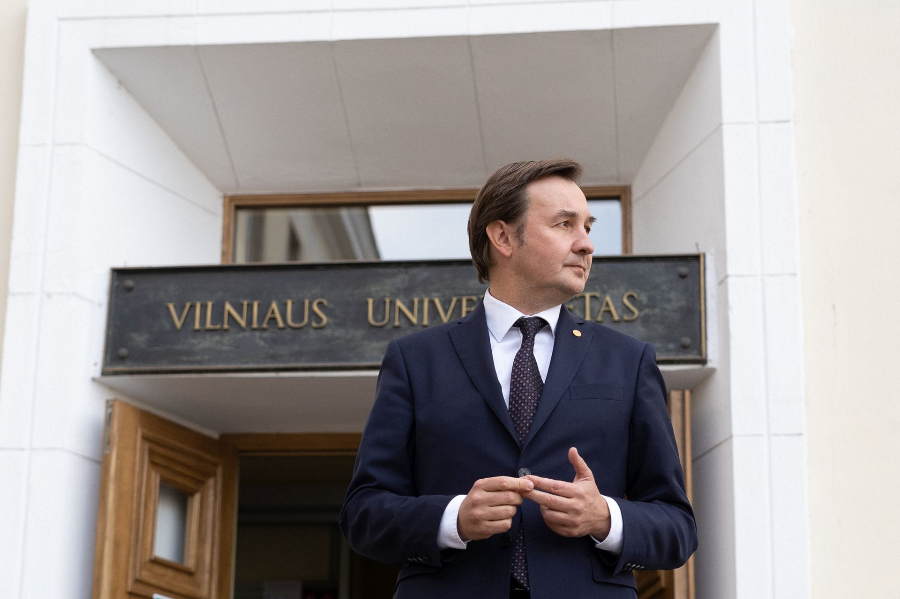
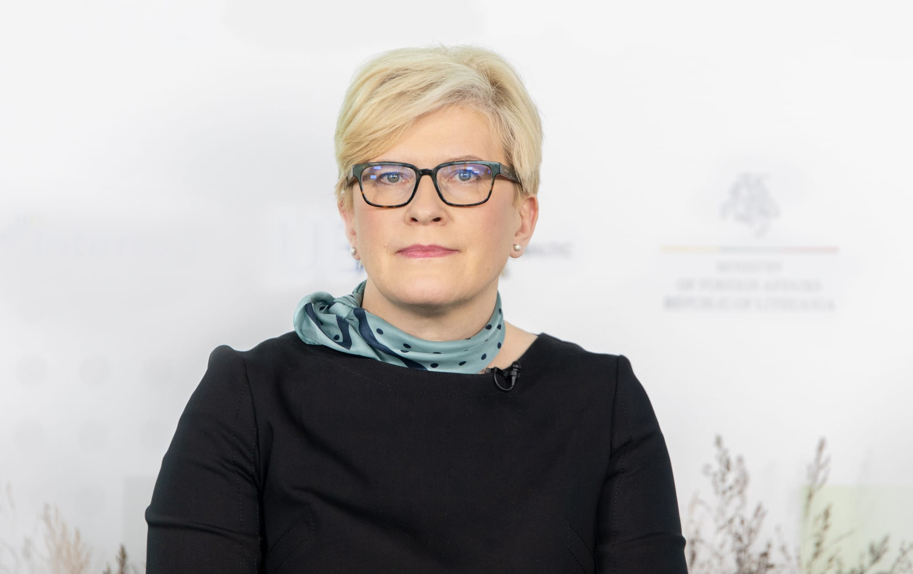
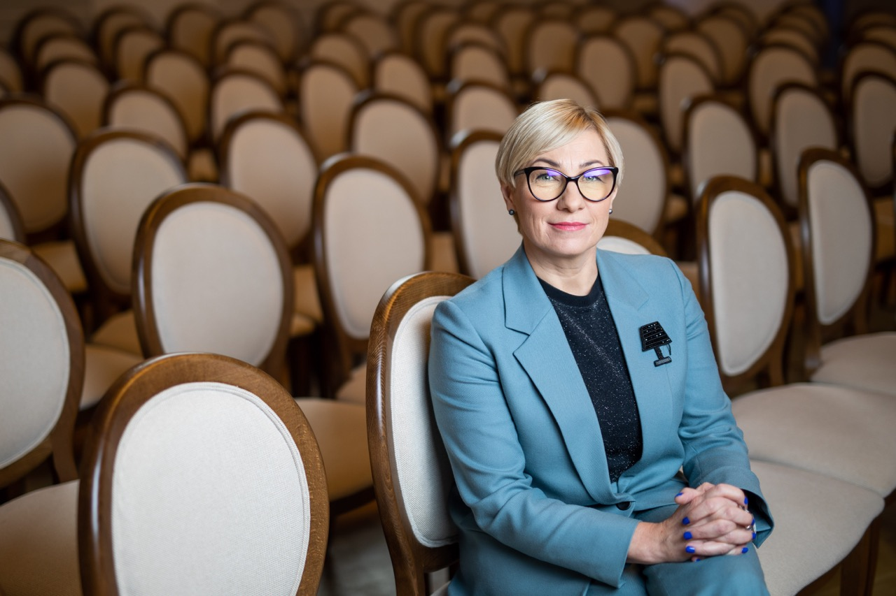
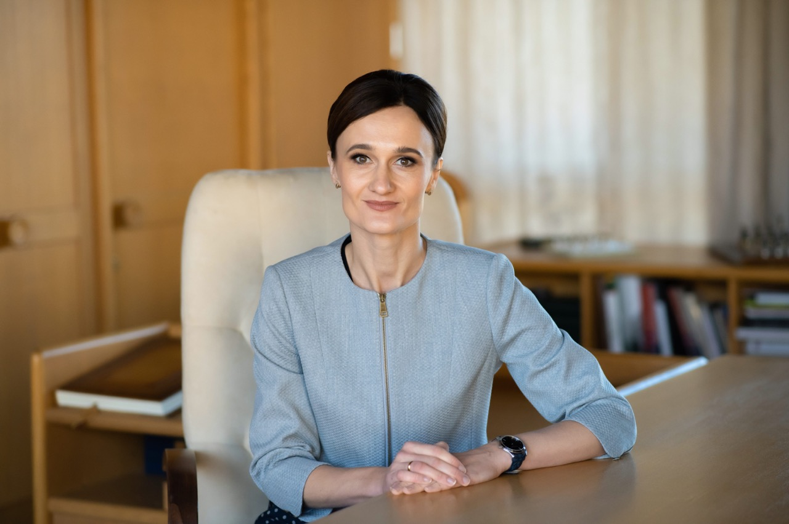
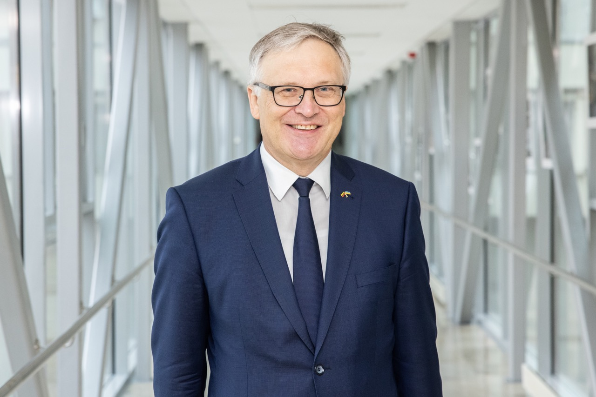
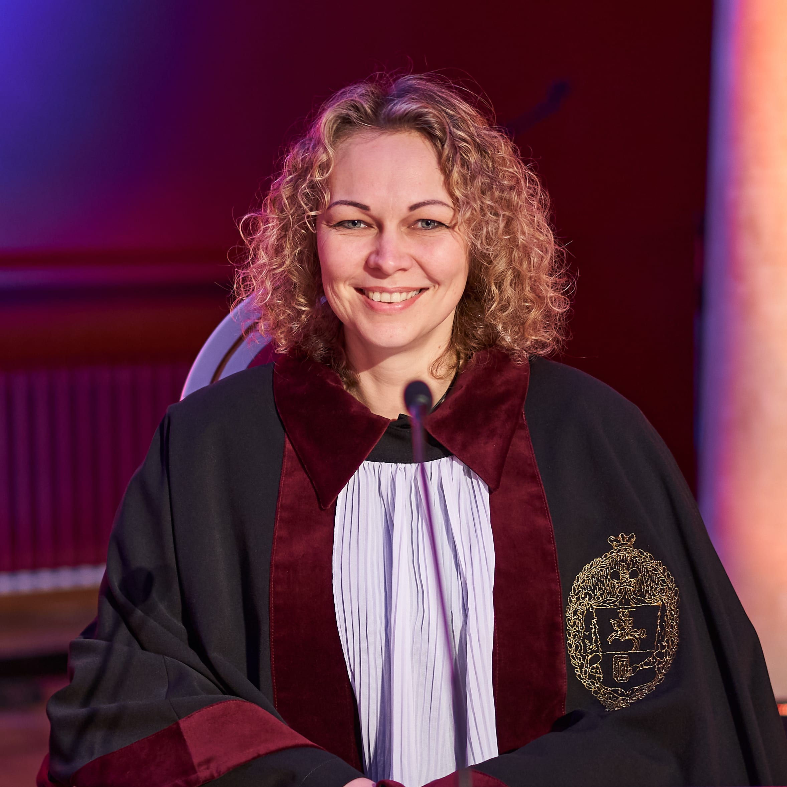
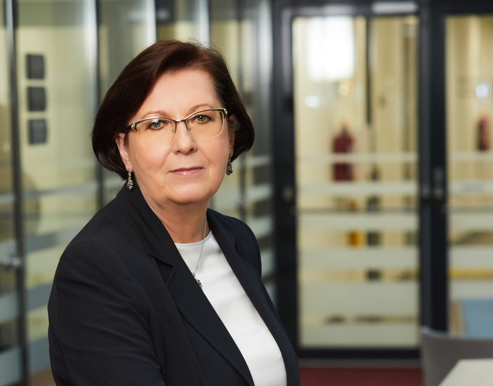
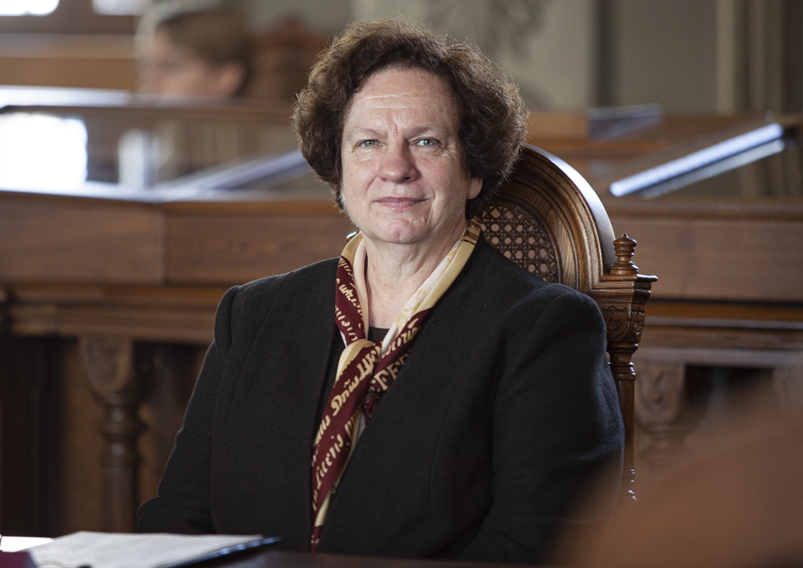
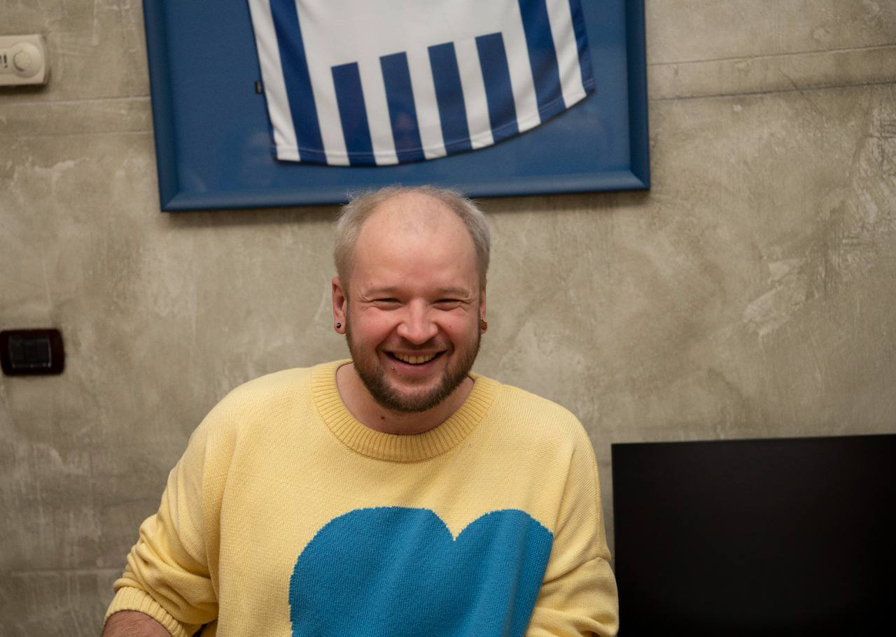

# Congratulations

<!-- TODO: reikia nuotraukų -->

## Vilnius University Rector

Dear Students,

I am proud of your activities inside and outside the University, proving
that we have an intelligent, responsible and creative student body.

It\'s especially important that you don\'t wait for someone else to take
the initiative or point the direction, but instead you take action and
implement things first. While we are still developing the concept of the
\"Green University\", you have already organized the first green
festival \"Cool the heat\". Because of your integration initiatives,
hundreds of young people who join our community every year can
immediately feel part of the University. During the \"Career Days\" you
show the opportunities and diversity that open up after graduating from
the University, bringing students and employers together.

Your enthusiasm encourages us to overcome obstacles and pursue
individualized studies, which will provide the opportunity to learn even
more and allow us all to move towards interdisciplinary studies.

Your voice is heard not only at the University, but also in government
institutions. You raise important questions not only for students, but
also for the entire academic community. It is gratifying that we are
able to constructively reconcile positions and represent the University
together in other institutions and throughout the public space of
Lithuania.

Students are an active and determined part of community. I encourage you
to continue to express yourselves actively in academia, politics,
business, volunteer activities, represent the University and spread
ideas that are important to everyone beyond its walls.

I congratulate Vilnius University Students' Representation, which
assumes the responsibility of understanding, coordinating, and defending
the interests of a large and diverse student community in order to
create the best possible conditions for every student and contribute to
the progress of the entire state and society.

Rector of Vilnius University

Prof. Rimvydas Petrauskas

**Prof. Rimvydas Petrauskas**

## Government of the Republic of Lithuania

{.rounded-sm}

Dear students of Vilnius University,

Another year has drawn to a close. As you yourselves said that just
recently the war in Europe seemed and was believed to be a thing of the
past – a relic of the 20th century, and that 'never again' seemed to be
a lasting promise that the world had learnt from its worst mistakes and
that the darkest chapters of history remained closed, never to be
reopened. Yet, it pains me to admit that we were wrong. The brutal war,
unfolding on our doorstep, makes us adhere ever closer to our core
values and remember who we are, what we stand for, and what we believe
in.

I am happy and proud that Vilnius University Students' Representation
(VU SR) has not remained a bystander in the face of adversity. You have
embraced and cared for every Ukrainian student who has become part of
the VU family. You have provided them with a sense of belonging and
security amidst the uncertainties they face. We cannot become tired in
our efforts of helping Ukraine – even if in small steps – as it
journeys towards an assured victory, which is crucial for a world that
cherishes freedom and human life. To help Ukraine recover and regain its
footing, well-educated specialists from various fields will be
indispensable.

Amidst the backdrop of this brutal war, we must not lose sight of the
many other transformative processes reshaping our global order. While
climate change has been a topic of discussion for quite some time, it is
imperative that we now move beyond mere talk and take proactive action.
We must address the pressing issues at hand and enhance our
understanding of the challenges we face in order to effectively combat
this global concern. Embracing a cleaner and greener way of life must
become an integral part of our existence. I am delighted to witness that
your Organization's Sustainability Declaration contains targets that
will guide you in changing your own habits, while also inspiring others
and setting an example to follow.

Another significant transformation is the advent of Industry 5.0 and
Artificial Intelligence. The future has arrived sooner than anticipated,
with chatbots readily available to assist us in tasks like paperwork. It
is high time we engaged in discussions about the opportunities and
challenges presented by these innovations, always remembering that true
leaders are those equipped with creative and critical thinking, able to
chart their own course and resist the temptation of the effortless path.
I have full confidence that your community will find academic integrity
agreements, and embrace the path of analysis, critical thinking, and
creativity.

In an ever-changing world, education, knowledge, and skills are our most
invaluable assets in overcoming new challenges, whatever they might be.
It is imperative that higher education and quality studies are made
accessible to all the deserving and ambitious individuals. I firmly
believe that through collaborative discussions, we can discover the best
solutions for a strong and enlightened Lithuania to thrive in the years
to come.

**Ingrida Šimonytė**

Prime Minister of the Republic of Lithuania

## LR Ministry of Education, Science and Sport

Dear students,

my sincere congratulations on the successful results of another year of
work. Your contribution is extremely important for improving the quality
of Lithuanian higher education, ensuring its accessibility and
internationality.

By actively representing your community, you give it a voice and
opportunities to act and develop. In this way, you contribute not only
to the well-being of students, but also to the well-being of Lithuania
as a whole – after all, the future of our country is created by
energetic and open to innovations of young people.

The mission of the state is to help precisely mature such members of
society who do not lack courage and determination, the ability to look
differently, to see more. We highly appreciate your initiatives and
constructive advice in creating an environment conducive to effective
higher education.

Positive change is brought about by close cooperation. I hope that we
will continue to work together to find the best solutions for the young
people of Lithuania.

Good luck and inspiration for meaningful future work!

Minister for Education, Science and Sport

**Jurgita Šiugždinienė**

## Seimas of the Republic of Lithuania

Dear students,

another year of activity of the Vilnius University Students\'
Representation is coming to an end, which together brought meaningful
and constructive cooperation with the Seimas of the Republic of
Lithuania.

That\'s how it should have been for a number of reasons.

Your Alma Mater gives academic freedom, develops professionalism, and
grows mature personalities. Therefore, you are active, critical,
determined, and civic. You can be believed and trusted. We also became
convinced of this during your practice in the Seimas.

You are the only student self-government organization that independently
represents them on a national scale, creates Lithuanian university
culture and fosters academic ethics.

In addition, you care about the quality of studies and the learning
environment, the integration and well-being of students, especially the
socially vulnerable, so you are active and determined where these issues
are discussed, coordinated, and addressed.

The programs and projects you implement provide opportunities for the
full self-expression of personalities, help to establish yourself in the
labor market and promote scientific activities in Lithuania and abroad.
And taking care of the future of the planet at the end of last year, you
took responsibility and a serious commitment to apply the green
principles of sustainability not only in the Student Representation, but
also at the university.

As long as there are motivated people like you, we can be sure of the
fate of Lithuania, Europe and the world.

I wish your community every success. Do not stop improving, learning,
and rejoicing. Be bold, strong and united!

Speaker of the Seimas

**Viktorija Čmilytė-Nielsen**

## Education and Science Committee of the Seimas of the Republic of Lithuania

Dear students of Vilnius University,

I sincerely congratulate you on another year of meaningful activity!

We are currently living in a global and very complex and, at the same time, turbulent, rapidly changing world. Recent years have been marked by extraordinary geopolitical and other challenges, but your focus, responsibility, bold and youthful initiatives inspire and do not leave anyone indifferent. Therefore, together we must strive for the goals set, so that Lithuania becomes a creative country of innovation based on knowledge. At all levels of higher education, the quality of studies must become a priority, which determines your future, the ability to create high economic, social and cultural value based on scientific knowledge. We must refine the missions of different types of higher education institutions and emphasize international indicators of the quality of studies – internationality, mobility of students and teachers, employability, active business involvement. Our common goal is to compete globally, not locally.

It is very important to strive for the management of higher education institutions to be based on the clearly declared goals of the State and the desire to raise the quality of science and studies. It is necessary to ensure more stability and opportunities for higher education institutions to invest in development, and for the academic community to ensure the most favorable conditions for conducting scientific activities and studies. The higher education management model will then encourage study and higher education institutions not to compete, but to cooperate, to jointly create a competitive study and scientific base that meets the needs of the future labor market.

You are active, responsible, and charming with your enthusiasm, courage and confidence. Thank you for your purposeful and significant activities that you are constantly contributing to positive and very important changes in the field of Lithuanian education, actively and constructively participate in the preparation and adoption of decisions of national importance together with the Committee on Education and Science of the Seimas of the Republic of Lithuania. Your efforts are vividly reflected in creating a high-quality higher education environment in Lithuania.
I believe that not only the realization of personal aspirations, but also the future of our entire country depends on your values, efforts, talent and cooperation.

Continue the work begun, boldly and responsibly take new ones! Good luck to all of you!

Chairman of the Education and Science Committee of the Seimas of the Republic of Lithuania
prof. Artūras Žukauskas

## Vilnius University Senate

Dear Students,

In 2022, we faced unimaginable evil and another crisis that affected
Lithuania. The war in Ukraine, which has been going on for more than a
year, has shown how important the spirit of unity, democracy, and
freedom is. How important is the role of the University in crises, when
each member can contribute to solving problems: expert insights,
volunteering, mentoring, financial support, and simple human warmth. The
integration of Ukrainian brothers and sisters into the VU community once
again revealed how strong we are together and how helping others
enriches our lives.

Congratulating the Students' Representation, I want to emphasize that
you are the student \"biofilm\" that holds the representatives of all
faculties together like glue. Therefore, you must work together, and
share your ideas, problems, and opportunities so that everyone\'s voice
is heard at Vilnius University. The important documents adopted this
year will allow students to choose their study path more freely, which
makes cooperation and mutual assistance between students of different
faculties even more important.

So, grow your community consciously and responsibly and spread good
practices and knowledge to all corners of Alma Mater. Seeing your
motivation, enthusiasm, responsibility, new ideas, great work, and
maturity of personalities, we can safely say that the future of
Lithuania is in safe hands.

Chairwoman of the Vilnius University Senate

**prof. Eglė Lastauskienė**

## Vilnius University Council

Dear colleagues,

Most higher education institutions around the world have already recognized that
the pandemic and other challenges of recent years have irreversibly changed the
paradigm of teaching and learning. We started talking about adaptive learning,
student mobility and digital experiences in the educational institution, the
need to promote innovation and creativity, joint projects with industry
organizations or hackathons on issues relevant to society.  

I see a huge contribution of VU SR to the formation of this new approach, it is great that the daily interaction of VU employees with the student community brings new ideas, promotes transformation. Naturally, students care about the sustainability, efficiency and transparency of the organization and we must try not to disappoint their expectations, we need to change, because if we stop, in this open world, students will find another organization that will respond to their expectations and dreams.

On behalf of the entire VU Council, I want to encourage you, students, not to stop, to continue to offer your ideas, the vision of your university, because it is the experience gained between the walls of the Alma mater that forms us as socially active personalities and professionals.

Chairwoman of the Council of Vilnius University

**dr. Eglė Radzevičienė**

## Vilnius University Library

Dear students

VUSR, uniting the most active part of Vilnius University students, is a
loyal and trustworthy partner of the Library, which comes up with many
interesting ideas for joint activities and projects, which gives us, the
Library, some constructive but always useful feedback, which is always
ready to help and give us generous support. We see a great value in our
traditional meetings between VUSR and Library members, where we discuss
information supply and other issues that are important for students,
where we look for possible solutions and are truly happy for successful
implementation of them.

You show no indifference and get involved in various activities of the
Library such us the Library service quality assessment survey (LibQual),
strategic planning projects, drawing of open science policy guidelines
implementation plan. Your constant support in enhancing information
competences of students undoubtedly had considerable impact on the
successful development of this activity and now we together work on yet
another initiative of VUSR ­-- to join forces and cooperate in the
development of students' academic literacy. The Library is grateful for
the discussions on possibilities to strengthen international efforts, to
contribute to students' physical and mental health, on sustainable
approach to the environment, harmony and the sense of community in our
organization. Much work is ahead of us, however, we hope that when
working together in close cooperation, we will be able to achieve a lot.

We are fascinated by your determination to go forward, by your
enthusiasm for learning and impulse to search and find. Your work at
VUSR, the experience you gain here will last a lifetime. I am very
thankful for your sincere cooperation and I would like to wish you to
preserve this youthful maximalism, energy and openness and I hope that
you will find a career and personal life path that will meet your
expectations. And wherever you go, please keep in touch with your *alma mater* and
remember that you are always welcome at our Library!

**Irena Krivienė**

Director General of Vilnius University Library

## Ombudswoman for academic ethics and procedures

Dear students,

we live in a time of technological innovation and information challenges. Questions are increasingly being raised about what new knowledge and skills the student should strive for, how to improve the quality of studies, so that today's decisions become the basis for the future of well-being. A lot of effort also must be made to separate the chaff from the grain, the truth from the untruth.

When applying technological innovations, it is important to jointly evaluate and introduce social innovations – measures that promote academic ethics. I believe that the combination of technological and social innovations will contribute to the transformations of the culture of academic ethics. Here, the involvement of all of you is very welcome. The most important thing is to remain proactive and creative – only in this way will you contribute to the development of international standards of academic ethics.

Unitedly for the Future of Students!

Controller of Academic Ethics and Procedures

dr. Loreta Tauginienė

## Knowledge Economy Forum

This year you have done a lot of work that any generation of VU SR could be proud of – the social dimension is defined by law, its development plan was prepared, funding for student scientific events, residents' salaries, work with doctoral students, an updated VU SR strategy was approved, and a VU greenness strategy is being developed.

It's especially gratifying that a good portion of those jobs were accomplishments that required long and continuous work. BUT it's often simpler to do what others expect of you or to do what you know will get a lot of support and approval. However, the work that is difficult and often has the most long-term impact is the work that perhaps no one will thank you for, and that a significant number of people will not even approve of at the beginning.

Implementation of the culture of reflection, use of gender-sensitive language, emphasis on gender equality problems, VU SR sustainability declaration and practical observance of those principles – vegetarian food during training, a sustainability festival organized for the first time – THANK YOU that in addition to the usual good and important works for students, you dared to be an example to other organizations and solve not only convenient problems.  

"You don't make progress by standing on the sidelines, whimpering and complaining. You make progress by implementing ideas" (Shirley Chisholm, not a white man, for a change of usual suspects in "wise quotes").

Arminas Varanauskas

He/Him
