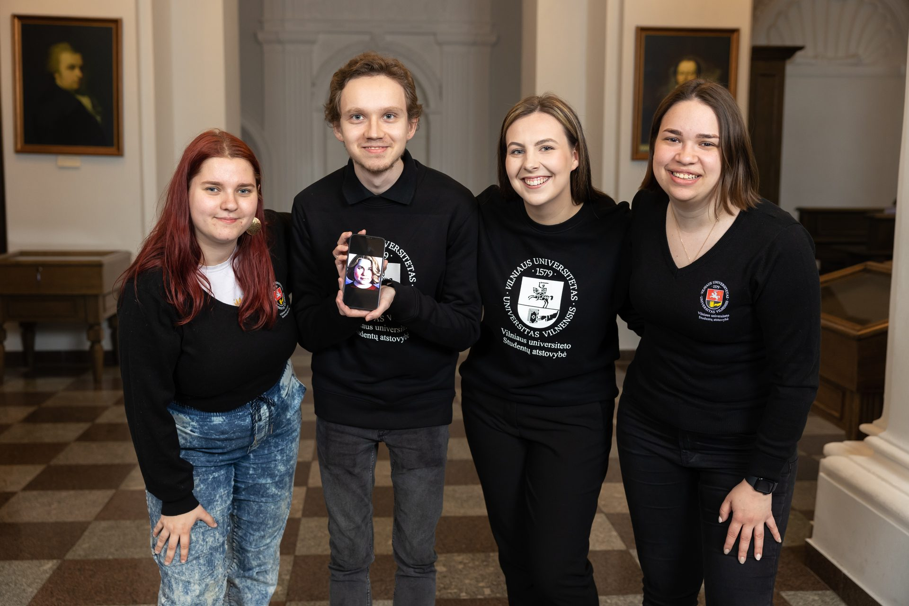

# Institutional Strengthening Fund

::: tip 📖 The Institutional Strengthening Fund is...
Responsible for raising the
competencies of the members of the organization, managing human
resources. The fund seeks to ensure the conditions for strengthening VU
SR and consistently raising competencies in the organization.
:::

::: details In Year 2022–2023 the Institutional Strengthening Fund consisted of...

- Vanesa Ražinskytė (chairperson)
- Julija Jarutytė
- Daniel Šematovič
- Martyna Vilutytė
- Milda Girdenytė

:::

Institutional strengthening is a set of processes focused on the
need-based improvement of the organization and its individual units or
activities, the development of the general and specific competencies of
its members, the strengthening of institutional memory, the initiation
of the development of tools, tools and methods necessary for activities.

This year, the Institutional Strengthening Fund not only took care of
the development of the competencies of the members of the organization,
but also carried out the following projects:

- Continued \"VU SR Reflects\" and encouraged the organization to
    reflect and self-reflect;

- Prepared materials for public speaking and time management seminars,
    which are available to all members of the organization;

- Updated the guidelines for the transfer of experience and translated
    into English;

- Continued the mentoring program – this year 17 members had mentors.

During the reference period, systematic work in the field of human
resources continued:

- In the summer, joint planning of the areas took place according to
    the most important problems identified during the Office-Council
    outing;

- Regular meetings between the Institutional Strengthening Fund and
    human resources coordinators continued (6 in total), during which
    topics relevant to the organization and its members were discussed:

  - Attracting and retaining members;

  - Time management;

  - Feedback;

  - Emotional environment;

  - General Meetings;

  - Transfer of experience;

  - Organization and planning of trainings.

- Competence development processes took place not only during
    trainings, but also during regular general meetings and simulations;

- Centrally organized training:

  - Training of curators;

  - Leadership training;

  - training of representatives of SPC students;

  - Training of Greenery Ambassadors;

- This year, the organization held more than 50 trainings with over
    1000 participants.
