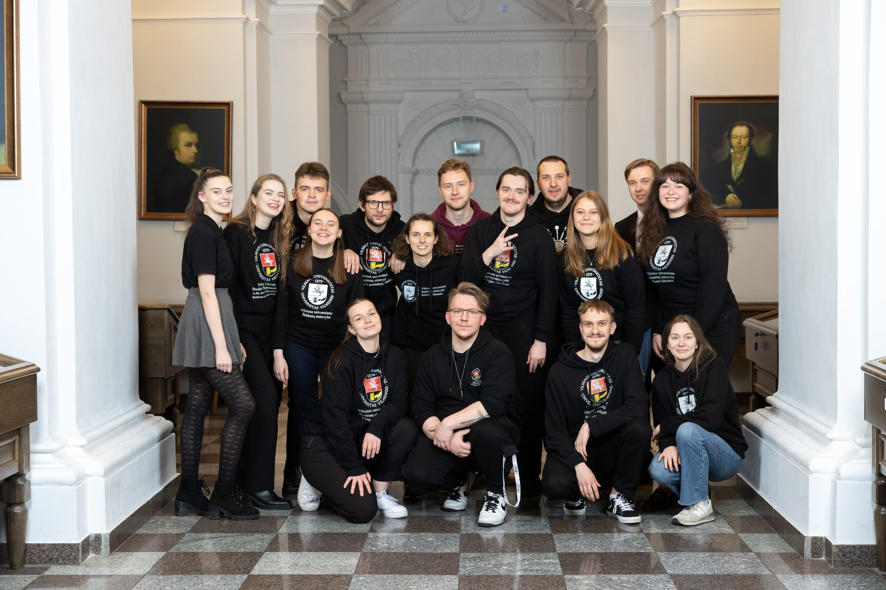

# VU SR Parliament

The VU SR Parliament was chaired by Justas Kvedaravičius.

In 2022 - 2023, the VU SR Parliament consisted of:

- VU SA Prezidentė Neda Žutautaitė
- **VU SA CHGF:** Ignas Mugenis, Andželika Jankauskytė, Rokas Gražinskas
- **VU SA EVAF:** Einoras Tiškevičius, Gabrielius Šuopys, Ieva Gruodytė
- **VU SA FilF:** Martynas Žaronaitis, Marijonas Kavaliauskas, Milgintė Jurkevičiūtė
- **VU SA FsF:** Dovilė Mikniūtė, Milda Eirošiūtė, Monika Bezručkina-Nadtočij
- **VU SA FF:** Justas Lebedevas, Arnoldas Solovjovas, Justas Kvedaravičius
- **VU SA GMC:** Eivinas Zableckas, Lukas Krasauskas, Martyna Vaitkūnaitė
- **VU SA IF:** Ieva Šiaudvytytė, Tomas Mikalauskas, Dinaras Motiečius
- **VU SA KnF:** Lijana Savickienė, Raigardas Tautkus, Karolina Latyševaitė
- **VU SA KF:** Martyna Pikelytė, Dominyka Goldbergaitė, Kristijonas Ražickas
- **VU SA MIF:** Gabrielė Kasperaitė, Simona Statauskaitė, Matas Bruson
- **VU SA MF:** Damian Luka Mialkowkyj, David Darius Poskus, Lurdes Gaidelytė
- **VU SA ŠA:** Vakarė Vasiliauskaitė, Paulius Ladukas, Justas Glinskis
- **VU SA TSPMI:** Anelė Dromantaitė, Ugnius Sejonas, Gytis Oškelis
- **VU SA TF:** Guoda Baubaitė, Airina Mikulėnaitė, Skaistė Sirutytė
- **VU SA VM:** Edgaras Kodis, Justas Petraitis, Michaela Andie Kleynhans

VU SR Parliament is the VU SR governing body, which considers the most important
social and academic issues related to students or other strategic issues of VU SR.
The VU SR Parliament consists of the president of the organization,
the vice-president, the chairpersons of the VU SR departments performing
the function of representation and two representatives from each unit.
The work of the VU SR Parliament is organized by the President.

During the reference period, there were 9 meatings of parliament – 8 live and 1 remote.

## Resolutions adopted in Parliament on positions and resolutions

### Adopted position on the employment of students at the University

VU SR Parliament adopted a position on the model of student recruitment to the
University, calling for the development of this international practice by improving
the participation of students in studies and strengthening their social status.
Parliamentarians have provided for concrete actions that can increase the high-quality
and valuable participation of students in their employment relations with the University.

### Position adopted on the preparation of students(s) for civil resistance and the performance of conscription

The VU SR Parliament, in response to the discussions in the country
on the ways and model of performing compulsory military service,
adopted a position calling for increasing the resilience of society and,
at the same time, the educational community to various threats. Adopting
the position, parliamentarians called for opportunities to be made available
for alternative conscription service without interrupting the period of study.

### VU SR sustainability declaration adopted

VU SR Parliament approved the VU SR Sustainability Declaration,
which calls and invites every member of VU SR and the University
community to follow the principles of greenness and sustainability
in their activities at the University and beyond.

## Other noteworthy resolutions relating to parliament's activities

- Student representatives were elected to the Vilnius University Senate
- The reports of the representatives of students elected by the VU SR Parliament
to the University Senate and the Council were heard
- The situation of VU Doctoral Studies at the University was discussed
- VU SR Parliament's Legal Working Group was formed
- VU SR budget for 2023 was approved
- The activity plan of VU SR for the current year was approved
- VU SR Strategic Activity Plan and Indicators were approved
