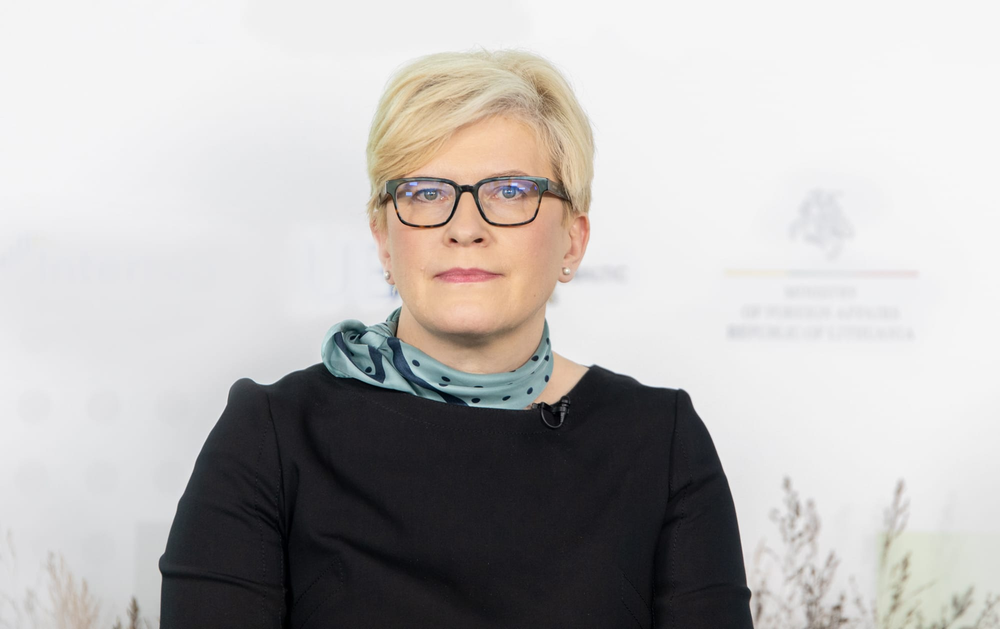
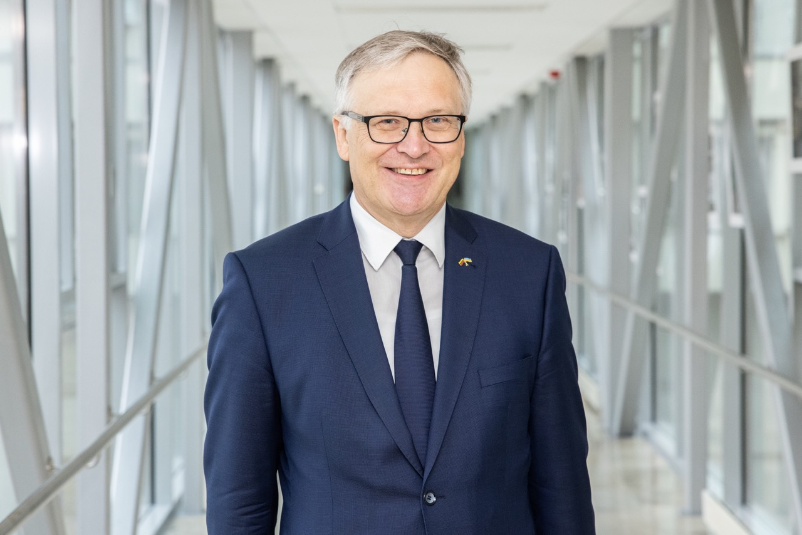
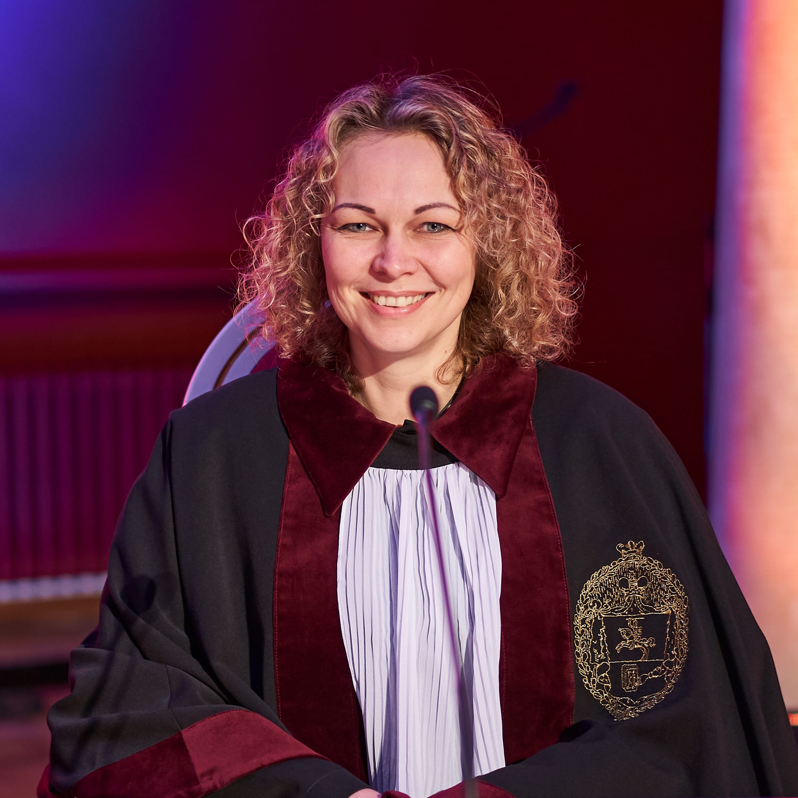
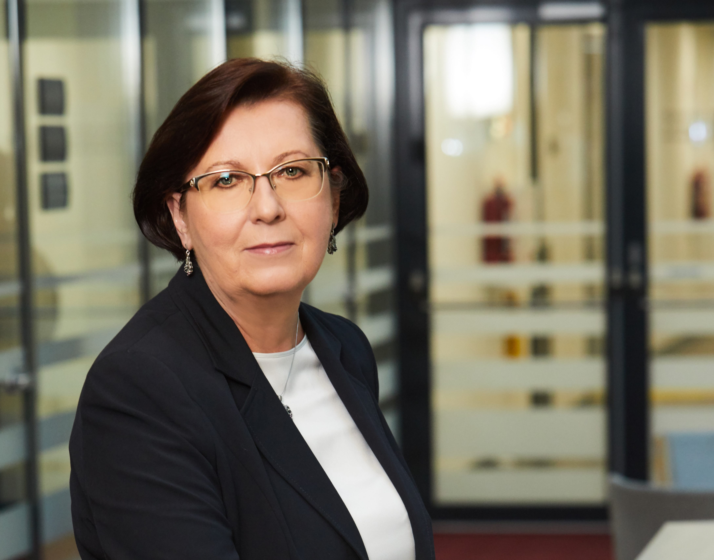

# Sveikinimai

<PhotoGrid :photos="sveikintojai" />

## Vilniaus universiteto Rektorius

Mieli Studentai ir Studentės,

didžiuojuosi Jūsų veikla Universitete ir už jo ribų, įrodančia, kad
turime protingą, atsakingą ir kūrybingą studentiją.

Ypač svarbu tai, kad jūs nelaukiate, kol kažkas kitas imsis iniciatyvos
ar nurodys kryptį, o pradedate ir įgyvendinate dalykus pirmieji.
Universitete dar tik rengiame „Žaliojo universiteto" koncepciją, o Jūs
jau suorganizavote pirmąjį žalumo festivalį „Ne per kaitriai". Dėka Jūsų
integracinių iniciatyvų šimtai jaunuolių, kasmet prisijungiančių prie
mūsų bendruomenės, gali iškart pasijusti Universiteto dalimi. „Karjeros
dienose" parodote galimybes ir įvairovę, kurios atsiveria baigus
Universitetą, į vieną būrį sukviesdami studentus ir darbdavius.

Jūsų entuziazmas skatina įveikti kliūtis, žengiant studijų individualumo
kryptimi, kurios suteiks galimybę pažinti dar daugiau ir leis mums
visiems judėti tarpdalykinių studijų link. Jūsų balsas girdimas ne tik
Universitete, bet ir valdžios įstaigose. Keliate svarbius klausimus ne
tik studentų, bet ir dėl visos akademinės bendruomenės labui. Džiugu,
kad pavyksta konstruktyviai derinti pozicijas ir drauge atstovauti
Universitetui kitose institucijose ir visoje Lietuvos viešojoje erdvėje.

Studentai yra aktyvioji ir ryžtingoji visuomenės dalis. Linkiu ir toliau
aktyviai reikštis akademijoje, politikoje, versle, savanorystės
veiklose, atstovauti Universitetui, skleisti visiems svarbias idėjas už
jo sienų.

Sveikinu Vilniaus universiteto Studentų atstovybę, kuri prisiima pareigą
ir atsakomybę suvokti, derinti ir ginti labai didelės ir įvairios
studentų bendruomenės interesus, siekdama sukurti kuo geresnes sąlygas
kiekvienam studentui, o kartu prisidėdama prie visos valstybės ir
visuomenės pažangos.

Vilniaus universiteto rektorius

**prof. Rimvydas Petrauskas**

## LR Vyriausybė

{.rounded-sm}

Mieli Vilniaus universiteto studentai ir studentės,

prabėgo dar vieni iššūkių kupini metai. Kaip patys sakėte, dar iki
2022-ųjų atrodė ir norėjosi tikėtis, kad karas Europoje – praeitis,
likusi XX amžiuje, o „niekada daugiau" – tvarus pažadas, kad pasaulis
pasimokė iš skaudžiausių klaidų ir juodžiausi istorijos puslapiai jau
nepasikartos. Skaudu pripažinti, kad klydome, o brutalus visai šalia
mūsų vykstantis karas verčia dar tvirčiau ir užtikrinčiau atsigręžti į
pamatines vertybes ir prisiminti, kas esame, ko siekiame ir kuo tikime.

Džiaugiuosi ir didžiuojuosi, kad VU SA neliko stebėtoja – ėmėtės
globoti kiekvieną ukrainietį (-ę) studentą (-ę), įstojusį (-ią) į VU
šeimą, ieškojote jiems namų ir padėjote jaustis visapusiškai saugiau
nežinomybės ir neapibrėžtumo situacijoje. Visi privalome nepritrūkti
kantrybės ir kad ir labai mažais žingsneliais padėti Ukrainai keliauti
link užtikrintos pergalės, kuri nepaprastai svarbi visam laisvę ir
žmonių gyvybes vertinančiam pasauliui. Tam, kad Ukraina atsigautų ir kuo
greičiau atsistotų ant kojų, tikrai labai reikės išsilavinusių savo
sričių specialistų.

Be žiauraus karo, pasaulyje vyksta ir daug kitų įprastą globalią tvarką
keičiančių procesų, kurių negalime pamiršti. Apie klimato kaitą kalbame
jau kurį laiką, bet turime ir aktyviai bei greitai reaguoti, spręsti jau
dabar esančias problemas, o kartu ir mokytis geriau suprasti, su kuo
susiduriame. Tvaresnis ir žalesnis gyvenimo būdas turi tapti mūsų
kasdienybe. Džiaugiuosi, kad VU SA organizacijos Tvarumo deklaracijoje
išsikelia uždavinius, kurie padės jums patiems keisti įpročius, taip pat
įkvėps bei rodys pavyzdį kitiems.

Dar vienas labai svarbus pokytis – pramonės 5.0 ir dirbtinio intelekto
revoliucija. Ateitis atėjo greičiau nei galbūt tikėjomės. Jau dabar
turime lengvai prieinamą pokalbių robotą, gundantį už mus atlikti namų
darbus. Turime diskutuoti apie šių inovacijų galimybes ir grėsmes kaip
ir prisiminti, kad lyderiais tampa kūrybiškai ir kritiškai mąstantys
žmonės, kurie patys moka samprotauti ir nepasuka lengviausiu keliu.
Tikiu, kad jūsų bendruomenė ras akademinio sąžiningumo susitarimus ir
rinksis analizės, kritinio mąstymo ir kūrybiškumo plėtojimo kelią.

Kad ir su kokiais naujais iššūkiais susidurtume greitai besikeičiančiame
pasaulyje, išsilavinimas, žinios ir įgūdžiai bus svarbiausias turtas, su
jais dorojantis. Aukštasis mokslas, kokybiškos studijos turi būti
prieinami kiekvienam ambicingam ir to nusipelniusiam, tad tikiu, kad
bendros diskusijos gali padėti rasti geriausius sprendimus ir kurti
stiprią, išmintingą ateities Lietuvą.

Lietuvos Respublikos Ministrė Pirmininkė

**Ingrida Šimonytė**

## LR Švietimo, mokslo ir sporto ministerija

Mieli studentai,

nuoširdžiai sveikinu su sėkmingais dar vienų metų darbo rezultatais.
Jūsų indėlis itin svarbus tobulinant Lietuvos aukštojo mokslo kokybę,
užtikrinant jo prieinamumą ir tarptautiškumą.

Aktyviai atstovaudami savo bendruomenei, suteikiate jai balsą bei
galimybes veikti ir tobulėti. Taip prisidedate ne tik prie studentijos,
bet ir visos Lietuvos gerovės – juk mūsų šalies ateitį kuria veržlūs ir
atviri naujovėms jauni žmonės.

Valstybės misija – padėti subręsti būtent tokiems visuomenės nariams,
kurie nestokoja drąsos ir ryžto, gebėjimo pažvelgti kitaip, matyti
daugiau. Itin vertiname jūsų iniciatyvas ir konstruktyvius patarimus
kuriant efektyviam aukštajam mokslui palankią aplinką.

Teigiamus pokyčius atneša glaudus bendradarbiavimas. Tikiuosi, kad ir
toliau dirbsime išvien, ieškodami geriausių sprendimų Lietuvos jaunimui.

Sėkmės ir įkvėpimo prasmingiems ateities darbams!

Švietimo, mokslo ir sporto ministrė

**Jurgita Šiugždinienė**

## LR Seimas

Mieli studentai,

baigiasi dar vieni Vilniaus universiteto Studentų atstovybės veiklos
metai, kartu atnešę prasmingą ir konstruktyvų bendradarbiavimą su
Lietuvos Respublikos Seimu.

Taip ir turėjo būti dėl daugelio priežasčių.

Jūsų *Alma mater* suteikia akademinę laisvę, ugdo profesionalumą ir
augina brandžias asmenybes. Todėl esate aktyvūs, kritiški, ryžtingi ir
pilietiški. Jumis galima tikėti ir pasitikėti. Tuo įsitikinome ir Jūsų
praktikos Seime metu.

Esate vienintelė studentų savivaldos organizacija, savarankiškai
atstovaujanti jiems nacionaliniu mastu, kurianti Lietuvos universitetinę
kultūrą ir puoselėjanti akademinę etiką.

Be to, Jums rūpi studijų kokybė ir mokymosi aplinka, studentų, ypač
socialiai pažeidžiamų, integracija ir gerovė, taigi esate aktyvūs ir
ryžtingi ten, kur svarstomi, derinami ir sprendžiami šie klausimai.

Jūsų įgyvendinamos programos ir projektai suteikia galimybių visapusei
asmenybių saviraiškai, padeda įsitvirtinti darbo rinkoje ir skatina
mokslinę veiklą Lietuvoje ir užsienyje. O rūpindamiesi planetos ateitimi
praėjusių metų pabaigoje prisiėmėte atsakomybę ir rimtus įsipareigojimus
žalius tvarumo principus pritaikyti ne tik Studentų atstovybėje, bet ir
universitete.

Kol yra tokių motyvuotų žmonių, kokie esate Jūs, galime būti ramūs dėl
Lietuvos, Europos ir pasaulio likimo.

Linkiu Jūsų bendruomenei įvairiapusės sėkmės. Nenustokite tobulėti,
mokytis ir džiaugtis. Būkite drąsūs, tvirti ir vieningi!

Seimo Pirmininkė

**Viktorija Čmilytė-Nielsen**

## LR Seimo Švietimo, mokslo ir sporto komitetas

Mieli Vilniaus universiteto studentai,
Nuoširdžiai sveikinu su dar vienais prasmingos veiklos metais!

Šiuo metu gyvename globaliame ir labai sudėtingame, o kartu ir neramiame, greitai besikeičiančiame pasaulyje. Pastarieji metai paženklinti neeilinių geopolitinių ir kitokių iššūkių, tačiau Jūsų susitelkimas, atsakomybė, drąsios bei jaunatviškos iniciatyvos įkvepia ir nepalieka abejingų. Todėl drauge turime siekti užsibrėžtų tikslų, kad Lietuva taptų kūrybiška inovacijų šalimi, besiremiančia žinojimu. Visuose aukštojo mokslo lygmenyse prioritetu turit tapti studijų kokybė, kuri lemia Jūsų ateitį, gebėjimą kurti aukštą ekonominę, socialinę ir kultūrinę vertę, remiantis mokslo žiniomis. Privalome išgryninti skirtingo tipo aukštųjų mokyklų misijas ir akcentuoti tarptautinius studijų kokybės rodiklius – tarptautiškumą, studentų ir dėstytojų mobilumą, įsidarbinamumą, aktyvų verslo įtraukimą. Mūsų visų bendras tikslas konkuruoti globaliai, o ne lokaliai.

Labai svarbu siekti, kad aukštųjų mokyklų valdymas būtų paremtas aiškiai deklaruojamais Valstybės tikslais ir siekiu kelti mokslo ir studijų kokybę. Aukštosioms mokykloms būtina užtikrinti daugiau stabilumo ir galimybių investuoti į plėtrą, o akademinei bendruomenei – kuo palankesnes sąlygas vykdyti mokslinę veiklą ir studijas. Tuomet aukštojo mokslo valdymo modelis skatins studijų ir mokslo institucijas ne konkuruoti, bet bendradarbiauti, bendrai kurti konkurencingą ir ateities darbo rinkos poreikius atitinkančią studijų ir mokslo bazę.

Esate aktyvūs, atsakingi ir žavūs savo entuziazmu, drąsa bei pasitikėjimu. Dėkoju, kad savo kryptinga ir reikšminga veikla nuolat prisidedate prie teigiamų ir labai svarbių pokyčių Lietuvos švietimo srityje, aktyviai ir konstruktyviai dalyvaujate rengiant bei priimant nacionalinės reikšmės sprendimus drauge su LR Seimo Švietimo ir mokslo komitetu. Jūsų pastangos ryškiai atsispindi kuriant kokybišką aukštojo mokslo aplinką Lietuvoje.

Tikiu, kad nuo Jūsų vertybių, pastangų, talento  bei bendradarbiavimo priklauso ne tik asmeninių siekių įgyvendinimas, bet ir visos mūsų šalies ateitis.
Tęskite pradėtus darbus, drąsiai ir atsakingai imkitės naujų! Sėkmės Jums visiems!

LR Seimo Švietimo ir mokslo komiteto pirmininkas
prof. Artūras Žukauskas

## Vilniaus universiteto Senatas

Mieli Studentai,

2022 m. susidūrėme su sunkiai įsivaizduojamu blogiu ir dar viena krize,
kuri palietė mūsų Valstybę. Jau daugiau nei metus besitęsiantis karas
Ukrainoje parodė, kokia svarbi yra vienybės, demokratijos ir laisvės
dvasia. Koks svarbus krizėse yra Universiteto vaidmuo, kai kiekvienas
narys į problemų sprendimą gali įnešti savo indėlį: ekspertines
įžvalgas, savanorystę, mentorystę, finansinę paramą ir tiesiog žmogišką
šilumą. Ukrainiečių brolių ir seserų integravimas į VU bendruomenę dar
kartą atskleidė, kokie stiprūs mes esame kartu ir kaip pagalba kitiems
praturtina mūsų gyvenimus.

Sveikindama Studentų atstovybę noriu prabrėžti, kad būtent Jūs esate ta
studentiška „bioplėvelė", kuri kaip klijai laiko visų fakultetų
atstovus. Todėl labai svarbu, kad veiktumėte kartu, dalintumėtės savo
idėjomis, problemomis ir galimybėmis, kad Vilniaus universitete būtų
girdimas kiekvieno balsas. Šiais metais priimti svarbūs dokumentai leis
studentams laisviau rinktis savo studijų kelią, todėl dar svarbesnis
tampa skirtingų fakultetų studentų bendradarbiavimas ir pagalba vieni
kitiems.

Taigi auginkite savo bendruomenę sąmoningai ir atsakingai, skleiskite
gerąsias praktikas ir žinias į visus Alma mater kampelius. Matant Jūsų
motyvaciją, užsidegimą, atsakomybę, naujas idėjas, didelį darbą ir
asmenybių brandą galima drąsiai teigti, kad Lietuvos ateitis yra
saugiose rankose.

Vilniaus universiteto Senato pirmininkė

**prof. Eglė Lastauskienė**

## Vilniaus universiteto Taryba

Mieli kolegos ir kolegės,

Dauguma aukštojo mokslo įstaigų visame pasaulyje jau pripažino, kad
pandemija ir kiti pastarųjų metų iššūkiai negrįžtamai pakeitė mokymo ir
mokymosi paradigmą. Pradėjome kalbėti apie adaptyvų mokymąsi, studento
mobilumo ir skaitmenines patirtis mokymo įstaigoje, inovacijų ir
kūrybiškumo skatinimo būtinybę, bendrus projektus su pramonės
organizacijomis ar hakatonus visuomenei aktualiais klausimais.

Matau didžiulį VU SA indėlį formuojant šį naują požiūrį, smagu, kad
kasdienė VU darbuotojų sąveika su studentų bendruomene atneša naujas
idėjas, skatina transformaciją. Natūralu, kad studentams rūpi
organizacijos tvarumas, efektyvumas ir skaidrumas ir mes turime
pasistengti nenuvilti jų lūkesčių, turime keistis, nes jeigu
stabtelėsime, šiame atvirame pasaulyje studentai susiras kitą
organizaciją, kuri atlieps jų lūkesčius ir svajones.

Visos VU Tarybos vardu noriu jus, studentai, paskatinti nesustoti,
toliau siūlyti savo idėjas, savo universiteto viziją, nes būtent tarp
Alma mater sienų įgyta patirtis suformuoja mus kaip socialiai aktyvias
asmenybes ir profesionalus.

Vilniaus universiteto Tarybos pirmininkė

**dr. Eglė Radzevičienė**

## Vilniaus universiteto biblioteka

Mielos studentės, mieli studentai,

VU SA, vienijanti aktyviausią Vilniaus universiteto studentijos dalį,
yra ištikima ir patikima Bibliotekos partnerė, iš jos sulaukiame įdomių
bendros veiklos idėjų, kartais kritinio, tačiau visada konstruktyvaus
žvilgsnio, geranoriškos pagalbos ir nuoširdaus palaikymo. Vertiname jau
tradiciniais tapusius VU SA ir Bibliotekos atstovų (-ių) susitikimus,
kurių metu aptariame studentams aktualius informacinio aprūpinimo ir
kitus klausimus. Kartu ieškome galimų sprendimų ir ypatingai džiaugiamės
sėkmingu jų įgyvendinimu.

Gilinatės ir įsitraukiate į įvairias Bibliotekos veiklas: Bibliotekos
paslaugų kokybės vertinimo apklausą (LibQual) ir jos rezultatus,
strateginio plano projektus, atvirojo mokslo politikos gairių
įgyvendinimo plano rengimą. Jūsų nuolatinis palaikymas ugdant
besimokančiųjų informacines kompetencijas neabejotinai turėjo įtakos
sėkmingai šios veiklos plėtrai, o dabar dirbame ties dar viena VU SA
iniciatyva, t. y. kartu telkti jėgas ugdant studentų akademinį
raštingumą. Biblioteka dėkinga jums už diskusijas apie tarptautiškumo
stiprinimo galimybes, prisidėjimą prie studijuojančiųjų fizinės ir
psichinės sveikatos, tvarų požiūrį į aplinką, darną ir bendruomeniškumą
mūsų organizacijoje. Šiose srityse mūsų laukia dar daug darbų, bet
nuoširdžiai bendradarbiaudami (-os) neabejotinai nuveiksime daug.

Žavite pasiryžimu veržliai eiti į priekį, užsidegimu mokytis, ieškoti ir
atrasti. Jūsų veikla VU SA, čia įgyta patirtis išliks visam gyvenimui.
Dėkodama už nuoširdų bendradarbiavimą, linkiu išsaugoti jaunatvišką
maksimalizmą, aktyvumą ir atvirumą, surasti Jūsų lūkesčius atitinkančius
karjeros ir asmeninio gyvenimo kelius. Ir kur keliai benuvestų, niekada
nepraraskite ryšio su savo alma mater. Visada esate ir būsite laukiami
(-os) Bibliotekoje!

**Irena Krivienė**

VU bibliotekos generalinė direktorė

## Akademinės etikos ir procedūrų kontrolierė

Mieli studentai, mielos studentės,

gyvename technologinių naujovių ir informacinių iššūkių laikmečiu. Vis
dažniau keliami klausimai, kokių naujų žinių ir įgūdžių studentija
turėtų siekti, kaip gerinti studijų kokybę, kad šiandienos sprendimai
taptų pagrindu gerovės rytojui. Nemažai pastangų tenka įdėti ir
atskiriant pelus nuo grūdų, tiesą nuo netiesos.

Taikant technologines naujoves, svarbu kartu įvertinti ir diegti
socialines naujoves – akademinę etiką skatinančias priemones. Tikiu,
kad technologinių ir socialinių naujovių dermė prisidės prie akademinės
etikos kultūros transformacijų. Čia Jūsų visų įsitraukimas yra itin
laukiamas. Svarbiausia išlikti proaktyviems ir kūrybiškiems – tik taip
prisidėsite prie tarptautinių akademinės etikos standartų puoselėjimo.

**V**ieningai **U**ž **S**tudentų **A**teitį!

Akademinės etikos ir procedūrų kontrolierė

**dr. Loreta Tauginienė**

## Žinių ekonomikos forumas

Šiemet nuveikėte daug darbų, kuriais galėtų didžiuotis bet kuri VU SA
karta – socialinė dimensija apibrėžta įstatymu, rengtas jos plėtros
planas, finansavimas studentų mokslo renginiams, rezidentų atlyginimai,
darbas su doktorantais, patvirtinta atnaujinta VU SA strategija, kuriama
VU žalumo strategija.

Ypač smagu, kad nemaža tų darbų dalis buvo ilgo ir tęstinio įdirbio
reikalavę pasiekimai. BET dažnai paprasčiau yra daryti tai, ko iš tavęs
tikisi kiti ar daryti tai, kas žinai, jog sulauks daug palaikymo ir
pritarimo. Visgi sunkūs, o neretai ir ilgalaikiškiausią poveikį
lemiantys darbai – tie, už kuriuos galbūt net niekas nepadėkos, kuriems
nemaža dalis pradžioje net nepritars.

Refleksijos kultūros diegimas, lyčiai jautrios kalbos naudojimas, lyčių
lygybės problemų sureikšminimas, VU SA tvarumo deklaracija ir praktinis
tų principų laikymasis – vegetariškas maistas per mokymus, pirmą kartą
organizuotas tvarumo festivalis – **AČIŪ**, kad šalia įprastų gerų ir
svarbių darbų studentams, išdrįsote būti pavyzdžiu kitoms organizacijoms
bei spręsti ne tik *patogias* problemas.

„Pažanga pasiekiama ne stovint nuošalyje, verkšlenant ir skundžiantis, o
įgyvendinant idėjas" (Shirley Chisholm, ne baltaodis vyras, for a change
of usual suspects in „wise quotes").

Arminas

he/him
